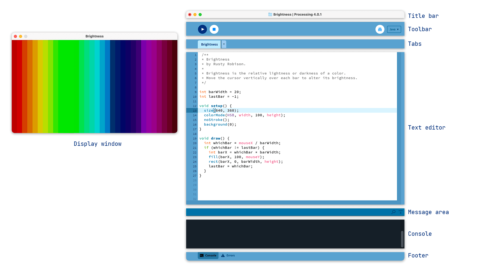

<Intro>
  The Processing Environment includes a text editor, a compiler, and a display
  window. It enables the creation of software within a carefully designed set of
  constraints.
</Intro>

## Overview

The Processing Development Environment (PDE) makes it easy to write Processing programs. Programs are written in the Text Editor and started by pressing the Run button. In Processing, a computer program is called a _sketch_. Sketches are stored in the _Sketchbook_, which is a folder on your computer.

Sketches can draw two- and three-dimensional graphics. The default renderer is for drawing two-dimensional graphics. The P3D renderer makes it possible to draw three-dimensional graphics, which includes controlling the camera, lighting, and materials. The P2D renderer is a fast, but less accurate renderer for drawing two-dimensional graphics. Both the P2D and P3D renderers are accelerated if your computer has an OpenGL compatible graphics card.

The capabilities of Processing are extended with _Libraries_ and _Tools_. Libraries make it possible for sketches to do things beyond the _core_ Processing code. There are hundreds of libraries contributed by the Processing community that can be added to your sketches to enable new things like playing sounds, doing computer vision, and working with advanced 3D geometry. Tools extend the PDE to help make creating sketches easier by providing interfaces for tasks like selecting colors.

Processing has different _programming modes_ to make it possible to deploy sketches on different platforms and program in different ways. The Java mode is the default. Other programming modes may be downloaded by selecting "Add Mode..." from the menu in the upper-right corner of the PDE.

## Processing Development Environment (PDE)

The Processing Development Environment (PDE) consists of a simple text editor for writing code, a message area, a text console, tabs for managing files, a toolbar with buttons for common actions, and a series of menus. The menu options change from mode to mode. The default Java mode is documented here.



Programs written using Processing are called sketches. These sketches are written in the text editor. It has features for cutting/pasting and searching/replacing text. The message area gives feedback while saving and exporting and also displays errors. The console displays text output by Processing sketches including complete error messages and text output from sketches with the `print()` and `println()` functions. (Note that the console works well for occasional messages, but is not intended for high-speed, real-time output.)

The buttons on the toolbar can run and stop programs,

<dl>
<dt>

<FixedImage inline marginRight={30} width={40}>


</FixedImage>

<b>Run</b>
</dt>
<dd>Runs the sketch. In Java mode, it compiles the code and opens a new display window. </dd>
<dt>

<FixedImage inline marginRight={30} width={40}>


</FixedImage>

<b>Stop</b>
</dt>
<dd>Terminates a running sketch.</dd>
</dl>

Additional commands are found within the six menus: File, Edit, Sketch, Debug, Tools, Help. The menus are context-sensitive which means only those items relevant to the work currently being carried out are available.

### File

<dl>
  <dt>New</dt>
  <dd>
    Creates a new sketch in a new window, named as the current date in the
    format `sketch_YYMMDDa`.
  </dd>
  <dt>Open...</dt>
  <dd>Open a sketch in a new window.</dd>
  <dt>Open Recent</dt>
  <dd>Select a sketch to open from the list of recently closed sketches.</dd>
  <dt>Sketchbook...</dt>
  <dd>Open a new window to show the list of sketches in the sketchbook.</dd>
  <dt>Examples...</dt>
  <dd>Open a new window to show a list of examples.</dd>
  <dt>Close</dt>
  <dd>
    Close the sketch in the frontmost window. If this is the last sketch that's
    open, you will be prompted whether you would like to quit. To avoid the
    prompt, use Quit instead of Close when you want to exit the application.
  </dd>
  <dt>Save</dt>
  <dd>Saves the open sketch in its current state.</dd>
  <dt>Save As...</dt>
  <dd>
    Saves the currently open sketch, with the option of giving it a different
    name. Does not replace the previous version of the sketch.
  </dd>
  <dt>Export Application...</dt>
  <dd>
    Exports a Java application as an executable file and opens the folder
    containing the exported files.
  </dd>
  <dt>Page Setup</dt>
  <dd>Define page settings for printing.</dd>
  <dt>Print...</dt>
  <dd>Prints the code inside the text editor.</dd>
  <dt>Preferences...</dt>
  <dd>
    Change some of the ways Processing works. (This item is located in the
    Processing menu on macOS.)
  </dd>
  <dt>Quit</dt>
  <dd>
    Exits the Processing Environment and closes all Processing windows. (This
    item is located in the Processing menu on macOS.)
  </dd>
</dl>

### Edit

<dl>
  <dt>Undo</dt>
  <dd>
    Reverses the last command or the last entry typed. Cancel the Undo command
    by choosing Edit » Redo.
  </dd>
  <dt>Redo</dt>
  <dd>
    Reverses the action of the last Undo command. This option is only available
    if there has already been an Undo action.
  </dd>
  <dt>Cut</dt>
  <dd>
    Removes and copies selected text to the clipboard (an off-screen text
    buffer).
  </dd>
  <dt>Copy</dt>
  <dd>Copies selected text to the clipboard.</dd>
  <dt>Copy as HTML</dt>
  <dd>
    Formats code as HTML in the same way it appears in the Processing
    environment and copies it to the clipboard so it can be pasted somewhere
    else.
  </dd>
  <dt>Paste</dt>
  <dd>
    Inserts the contents of the clipboard at the location of the cursor, and
    replaces any selected text.
  </dd>
  <dt>Select All</dt>
  <dd>
    Selects all of the text in the file which is currently open in the text
    editor.
  </dd>
  <dt>Auto Format</dt>
  <dd>
    Attempts to format the code into a more human-readable layout. Auto Format
    was previously called _Beautify_.
  </dd>
  <dt>Comment/Uncomment</dt>
  <dd>
    Comments the selected text. If the selected text is already commented, it
    uncomments it.
  </dd>
  <dt>Increase Indent</dt>
  <dd>Indents the selected text by two spaces.</dd>
  <dt>Decrease Indent (Ctrl+[)</dt>
  <dd>If the text is indented, removes two spaces from the indent.</dd>
  <dt>Find...</dt>
  <dd>
    Finds an occurrence of a text string within the file open in the text editor
    and gives the option to replace it with a different text.
  </dd>
  <dt>Find Next</dt>
  <dd>
    Finds the next occurrence of a text string within the file open in the text
    editor.
  </dd>
  <dt>Find Previous</dt>
  <dd>
    Finds the previous occurrence of a text string within the file open in the
    text editor.
  </dd>
  <dt>Use Selection for Find</dt>
  <dd>
    Sets the currently selected text as the item to find with Find Next and Find
    Previous.
  </dd>
</dl>

### Sketch

<dl>
  <dt>Run</dt>
  <dd>
    Runs the code (compiles the code, opens the display window, and runs the
    sketch inside)
  </dd>
  <dt>Present</dt>
  <dd>
    Runs the code in the center of the screen with a solid-color background.
    Click the "stop" button in the lower left to exit the presentation or press
    the Escape key. Change the background color in the Preferences.
  </dd>
  <dt>Tweak</dt>
  <dd>
    Runs the code in a way where some color and variable values can be changed
    while the code is running. The sketch needs to be saved before it can be run
    as a sketch to Tweak.
  </dd>
  <dt>Stop</dt>
  <dd>
    If the code is running, stops the execution. Programs written without using
    the draw() function are stopped automatically after they draw.
  </dd>
  <dt>Import Library...</dt>
  <dd>
    Adds the necessary import statements to the top of the current sketch. For
    example, selecting Sketch » Import Library » pdf adds the statement "import
    processing.pdf.\*;" to the top of the file. These import statements are
    necessary for using Libraries. Select Add Libraries... to open the Library
    Manager to browse and install new libraries.
  </dd>
  <dt>Show Sketch Folder</dt>
  <dd>Opens the folder for the current sketch.</dd>
  <dt>Add File...</dt>
  <dd>
    Opens a file navigator window. Select an image, font, or other media files
    to add it to the sketch's "data" folder.
  </dd>
</dl>

### Debug

<dl>
  <dt>Enable Debugger</dt>
  <dd>
    Activates the debugger. Note that the Run button will change to Debug. New
    Continue and Step buttons will appear, along with a separate window for
    viewing variable values.
  </dd>
  <dt>Continue</dt>
  <dd>Advances the code until the next breakpoint.</dd>
  <dt>Step</dt>
  <dd>
    Advances the code one line at a time. (Note that once the code reaches the
    end of the current function call, the debugger will rever to "continue.")
  </dd>
  <dt>Step Into</dt>
  <dd>
    Advances the debugger into the interior of a function call. This only works
    for user-defined functions in the sketch.
  </dd>
  <dt>Step Out</dt>
  <dd>
    Advances the debugger outside of a function to the calling area. This only
    works for user-defined functions in the sketch.
  </dd>
  <dt>Toggle Breakpoint</dt>
  <dd>
    Add or remove a breakpoint. When a breakpoint is added, the line number is
    replaced with the symbol: `&lt;&gt;`.
  </dd>
</dl>

### Tools

<dl>
  <dt>Archive Sketch</dt>
  <dd>
    Archives a copy of the current sketch in .zip format. The archive is placed
    in the same folder as the sketch.
  </dd>
  <dt>Color Selector...</dt>
  <dd>
    Interface for selecting colors. For each color, the HSB, RBG, and Hex values
    are shown. The Hex value can be copied into the clipboard with the Copy
    button.
  </dd>
  <dt>Create Font...</dt>
  <dd>
    Converts fonts into the Processing font format (VLW) and adds to the current
    sketch. Opens a dialog box that gives options for setting the font, its
    size, if it is anti-aliased (smooth), and which characters to be generated.
    The amount of memory required for the font is determined by the size
    selected and the number of characters selected through the "Characters..."
    menu; Processing fonts are textures, so larger fonts require more image
    data. Fonts can also be created in the code with the createFont() function.
  </dd>
  <dt>Theme Selector</dt>
  <dd>
    Interface for selecting themes for Processing, with options to read about 
    how to create your own themes as well as save them to a sketchbook for editing.
  </dd>
  <dt>Movie Maker</dt>
  <dd>
    Creates a QuickTime movie from a sequence of images. Options include setting
    the size, frame rate, and compression, as well as an audio file.
  </dd>
  <dt>Manage Tools...</dt>
  <dd>Opens the Contribution Manager</dd>
</dl>

### Help

<dl>
  <dt>About Processing</dt>
  <dd>
    Opens information about Processing 4
  </dd>
  <dt>Welcome to Processing</dt>
  <dd>
    Opens a dialog box containing information that helps a new user get started with Processing
  </dd>
  <dt>Environment</dt>
  <dd>
    Opens the reference for the Processing Development Environment (this page)
    in the default web browser.
  </dd>
  <dt>Reference</dt>
  <dd>
    Opens the reference in the default web browser. Includes references for the
    language, programming environment, and core libraries.
  </dd>
  <dt>Find in Reference</dt>
  <dd>
    Select an element of the Processing language in the text editor and select
    Find in Reference to open that page in the default web browser.
  </dd>
  <dt>Download Offline Reference</dt>
  <dd>
    Downloads the Processing Offline Reference
  </dd>
  <dt>Libraries Reference</dt>
  <dd>Select from the list to open the reference for compatible Libraries.</dd>
  <dt>Tools Reference</dt>
  <dd>Select from the list to open the reference for compatible Tools.</dd>
  <dt>Getting Started</dt>
  <dd>Opens the online Getting Started tutorial in the default browser.</dd>
  <dt>Troubleshooting</dt>
  <dd>Opens the online Troubleshooting wiki page in the default browser.</dd>
  <dt>Frequently Asked Questions</dt>
  <dd>Opens the online FAQ wiki page in the default browser.</dd>
  <dt>The Processing Foundation</dt>
  <dd>Opens the Foundation website in the default browser.</dd>
  <dt>Visit Processing.org</dt>
  <dd>Opens Processing website in the default browser.</dd>
</dl>

## Preferences

The Processing Development Environment (PDE) is highly configurable. The most common preferences can be modified in the Preferences window, located in the File menu on Windows and Linux and the Processing menu on macOS. The full list of preferences is stored in the "preferences.txt" file. This file can be opened and edited directly only when Processing is not running. You can find the location of this file on your computer by reading the bottom-left corner of the Preferences window.

<dl>
  <dt>Sketchbook location</dt>
  <dd>
    Any folder can be used as the Sketchbook. Input a new location or select
    "Browse" to set the folder you want to use.
  </dd>
  <dt>Language</dt>
  <dd>
    Select the language to use for the menus. Processing needs to be restarted
    after making a new selection.
  </dd>
  <dt>Editor and Console font</dt>
  <dd>
    Select a different font to use for text in the Editor and Console. Note: the
    selected font should match the language used in the Text Editor. See the
    "Enable complex text input" preference below.
  </dd>
  <dt>Editor font size</dt>
  <dd>Sets the font size of the code in the text editor.</dd>
  <dt>Console font size</dt>
  <dd>Sets the font size of the text in the console.</dd>
  <dt>Background color when Presenting</dt>
  <dd>Defined the background color used when a sketch is run with Present.</dd>
  <dt>Use smooth text in editor window</dt>
  <dd>
    By default, the text in the editor is aliased. When checked, the editor
    switches to an anti-aliased (smoothed) font. Restart Processing after making
    this change.
  </dd>
  <dt>Enable complex text input</dt>
  <dd>
    Enables the Text Editor to display non-Latin fonts such as Japanese.
    Processing needs to be restarted after making this selection.
  </dd>
  <dt>Continuously check for errors and Show warnings</dt>
  <dd>
    Turn on and off the features that continuously check for and report
    potential code errors.
  </dd>
  <dt>Code completion with Ctrl-space</dt>
  <dd>
    Turn on and off code completion. Press Ctrl-space to activate code
    completion while typing.
  </dd>
  <dt>Suggest import statements</dt>
  <dd>
    When checked, Processing will try to suggest libraries to import when code
    from that library is detected.
  </dd>
  <dt>Increase maximum available memory</dt>
  <dd>
    Allocates more RAM to Processing sketches when they run. Sketches that use
    media files (images, audio, etc.) sometimes require more RAM. Increase the
    amount of RAM if a sketch is throwing Out of Memory Errors.
  </dd>
  <dt>Delete previous folder on export</dt>
  <dd>
    When checked (default behavior), Processing deletes the complete export
    folder before re-creating it and adding the new media.
  </dd>
  <dt>Check for updates on startup</dt>
  <dd>
    When checked (default behavior), you'll be informed of new Processing
    software releases as they become available through a small dialog box that
    opens as Processing starts.
  </dd>
  <dt>Run sketches on display</dt>
  <dd>
    If more than one monitor is attached, select the monitor on which to display
    the sketch.
  </dd>
</dl>

## Sketches and Sketchbook

All Processing projects are called sketches. Each sketch has its own folder. The main file for each sketch has the same name as the folder and is found inside. For example, if the sketch is named "Sketch_123", the folder for the sketch will be called "Sketch_123" and the main file will be called "Sketch_123.pde". The PDE file extension is an acronym for the Processing Development Environment

Processing sketches can be stored anywhere on your computer, but by default, they are stored in the sketchbook, which will be in different places on your computer or network depending if you use PC, Mac, or Linux and how the preferences are set. To locate this folder, select the "Preferences" option from the File menu (or from the "Processing" menu on the Mac) and look for the"Sketchbook location."

A sketch folder sometimes contains other folders for media files and other code. When a font or image is added to a sketch by selecting "Add File..." from the Sketch menu, a "data" folder is created. Files may also be added to your Processing sketch by dragging them into the text editor. Image and sound files dragged into the application window will automatically be added to the current sketch's "data" folder. All images, fonts, sounds, and other data files loaded in the sketch must be in this folder.

## Renderers

Processing has three built-in screen renderers. The default renderer is for drawing two-dimensional shapes. _P2D_ is a faster, but less accurate renderer for drawing two-dimensional shapes. _P3D_ is for three-dimensional geometry; it can also control the camera, lighting, and materials. The P2D and P3D renderers are accelerated if your computer has an OpenGL compatible graphics card. The `smooth()` function affects the amount of antialiasing for each renderer. Check the reference for `smooth()` for more information.

The renderer used for each sketch is specified through the `size()` function. If a renderer is not explicitly defined in `size()`, it uses the default renderer as shown in the following program:

```
void setup() {
  size(200, 200);
}

void draw() {
  background(204);
  line(width/2, height/2, mouseX, mouseY);
}
```

To change the renderer, add a third parameter to size(). For example

```
void setup () {
  size(200, 200, P2D);
}

void  draw() {
  background(204);
  line(width/2, height/2, mouseX, mouseY);
}
```

A large effort has been made to make Processing code behave similarly across the different renderers, but there are currently some inconsistencies that are explained in the reference. For more information, see the `size()` reference entry.

With the release of Processing 4.0, the _FX2D_ renderer is available as a separate Library. It is useful for 2D graphics on large or high resolution displays, and is usually much faster than the default renderer, though some features are still “experimental.” Install it by selecting Sketch → Import Library → Add Library, and selecting JavaFX from the list.  

## Coordinates

Processing uses a coordinate system with the origin in the upper-left corner. If your sketch is 320 pixels wide and 240 pixels high, coordinate (0, 0) is the upper-left pixel and coordinate (320, 240) is in the lower-right. The last visible pixel in the lower-right corner of the screen is at position(319, 239) because pixels are drawn to the right and below the coordinate.


Using the three-dimension coordinate system of P3D, the z-coordinate is zero at the surface of the image, with negative z-values moving back in space. When drawing in 3D, the _camera_ is positioned in the center of the screen.

## Tabs, Multiple Files, and Classes

It can be inconvenient to write a long program within a single file. When Processing sketches grow to hundreds or thousands of lines, breaking them into modular units helps manage the different parts. Processing manages files with the Sketchbook and each sketch can have multiple files that are managed with tabs.

The arrow button to the right of the tabs in the Processing Development Environment is used to manage these files. Click this button to reveal options to create a new tab, rename the current tab, and delete the current tab. Tabs are intended for more advanced users, and for this reason, the menu that controls the tabs is intentionally made less prominent.

<HighlightBlock>

_Advanced_

When a program with multiple tabs is run, the code is grouped together and the classes in other tabs become inner classes. Because they're inner classes, they cannot have static variables. Simply place the "static" variable outside the class itself to do the same thing (it need not be explicitly named "static" once you list it in this manner). If you don't want code to be an inner class, you can also create a tab with a ".java" suffix, which means it will be interpreted as straight java code. It is also not possible to use static classes in separate tabs. If you do this, however, you'll need to pass the PApplet object to that object in that tab in order to get PApplet functions like `line()`, `loadStrings()`, or `saveFrame()` to work.

</HighlightBlock>

## Debug

The Processing Debugger is a tool for diagnosing problems with a sketch. Enable it to pause a sketch while running and advance through the code one line at a time. The debugger is enabled through the File menu (Debug &gt; Enable Debugger) or by clicking the Debugger icon, the butterfly in the upper-right corner of the PDE.

When the Debugger is enabled, the program runs as normal, but stops at "breakpoints." To create a breakpoint, set the cursor at the line you want to pause the sketch and select Debug &gt; Toggle Breakpoint. The keyboard shortcut is Command-B. To remove the breakpoint, select Toggle Breakpoint again. When a breakpoint is added, the line number is replaced with the symbol: `&lt;&gt;`.

Running the sketch in Debug mode causes the sketch to pause at any breakpoints. When paused, current variable values are visible in a separate pane. You can advance to the next breakpoint by selecting "Continue" or advance line by line through the code with "Step". Stepping only works within the scope of the current function being run.

## Programming Styles

Processing allows people to create sketches at two levels of complexity that we call "static" and "active" sketches. People new to programming often begin with static sketches to learn about coordinates, variables, and other basics before moving to active sketches.

Static sketches don't include animation or interaction to focus on the early fundamentals of programming. Short lines of code have a direct representation on the screen. The following example draws a yellow rectangle on the screen:

```
size(200, 200);
background(255);
noStroke();
fill(255, 204, 0);
rect(30, 20, 50, 50);
```

Active sketches include a `setup()` structure that is run once when the sketch begins and a `draw()` structure which by default continually loops through the code inside. This additional structure allows writing custom functions and classes and using keyboard and mouse events.

The next example draws four circles on the screen and utilizes a custom function called `twoCircles()`. The `twoCircles()` function is not a part of the Processing language, but was written for this example. The code in `draw()` only runs once because `noLoop()` is called in `setup()`.

```
void setup() {
  size(200, 200);
  background(255);
  noLoop();
}
void draw() {
  twoCircles(40, 80);
  twoCircles(90, 70);
}
void twoCircles(int x, int y) {
  noStroke();
  fill(0, 102, 153, 204);
  ellipse(x, y, 50, 50);
  ellipse(x+20, y+20, 60, 60);
}
```

This example draws rectangles that follow the mouse position (stored in the system variables `mouseX` and `mouseY`). The `draw()` block runs forever until the sketch is stopped, thus creating the potential for motion and interaction.

```
void setup() {
  size(200, 200);
  rectMode(CENTER);
  noStroke();
  fill(0, 102, 153, 204);
}
void draw() {
  background(255);
  rect(width-mouseX, height-mouseY, 50, 50);
  rect(mouseX, mouseY, 50, 50);
}
```

### Java Code in the Processing Environment

Java files with the extension .java can be included with a sketch. They may be created directly in the PDE or copied into the sketch folder through the "Add File..." item in the Sketch menu or dragged into the text editor. It's possible to write any Java code in files with the .java extension. In fact, complete Java code can be written from inside the Processing Environment by subclassing PApplet like this:

```
public class MyDemo extends PApplet {
```

Using this technique means that any additional tabs will no longer be inner classes, meaning you'll have to do extra work to make them communicate properly with the host PApplet. It is not necessary to use this technique just to get features of the Java language. Advanced developers can also program with Processing in another Java Editor if higher-level code editing and tools are needed. Processing's core.jar can be used as a part of any Java project.

## Adding Libraries, Tools, and Modes

Processing 4.0 includes a set of features to make it easier to install, update, and remove Libraries, Tools, Modes, and Examples.

Add a contributed library by selecting "Add Library..." from the "Import Library..." submenu within the Sketch menu. This opens the Library Manager. Next, select a library and then click on Install to download it.

Add a contributed tool by selecting "Add Tool..." from the Tools menu, then select a Tool to download from the Tool Manager.

Add contributed modes by selecting "Add Mode..." from the Mode menu in the upper-right corner of the PDE, then select a Mode to install.

Add contributed Examples by first opening the "Examples..." submenu from the File menu. Click on the Add Examples button to open the Examples Manager. Next, select an examples package and select Install to download.

## Export

The [Export information and Tips](https://github.com/processing/processing/wiki/Export-Info-and-Tips) page on the Processing Wiki covers the details of exporting Applications from Java mode.

## Command Line Interface (CLI) 

Processing includes a Command Line Interface (CLI) to run sketches from the terminal. This is helpful for automation, testing, and headless setups.

Make sure Processing is installed, then run the help command to see all available options and examples.

*Windows*
```
processing --help | more
```

*macOS/Linux*
```
processing --help
```

_**Note:** On macOS, the CLI is not installed by default, run `tools -> install "processing" from Processing.  On Windows and Linux, Processing is typically added to your PATH by default, so no installation is needed._
