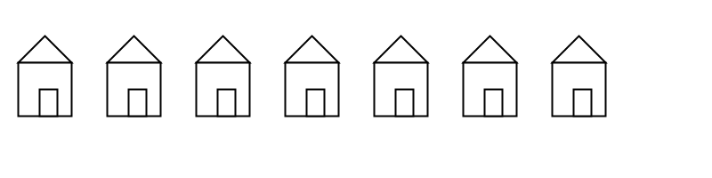
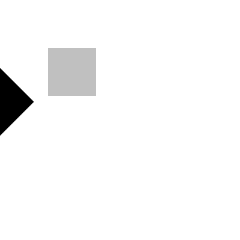
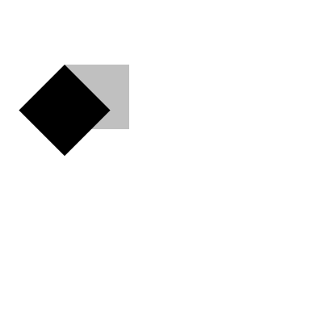
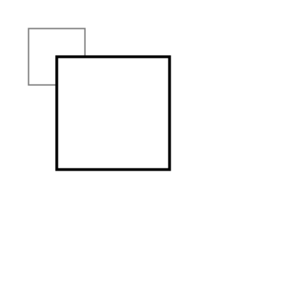
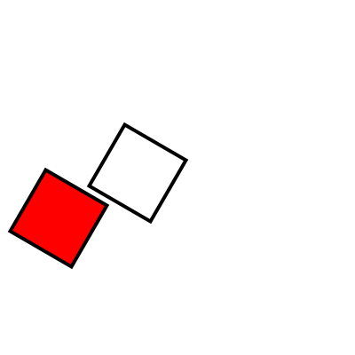
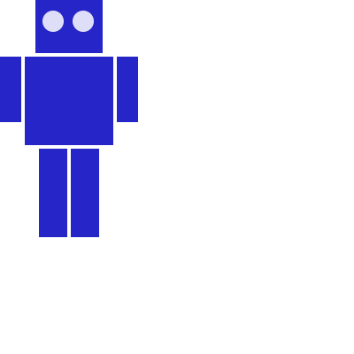
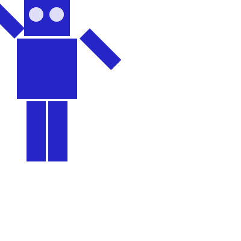

<Note>

If you see any errors in this tutorial or have comments, [please let us know](https://github.com/processing/processing-website/issues?q=is%3Aopen). This work is licensed under a [Creative Commons Attribution-NonCommercial-ShareAlike 4.0 International License](http://creativecommons.org/licenses/by-nc-sa/4.0/).

</Note>

Processing has built-in functions that make it easy for you to have objects in a sketch move, spin, and grow or shrink. This tutorial will introduce you to the `translate`, `rotate`, and `scale` functions so that you can use them in your sketches.

## Translation: Moving the Grid

As you know, your Processing window works like a piece of graph paper. When you want to draw something, you specify its coordinates on the graph. Here is a simple rectangle drawn with the code `rect(20, 20, 40, 40)`. The coordinate system (a fancy word for &ldquo;graph paper&rdquo;) is shown in gray.

<FixedImage center width={230} height={230}>


</FixedImage>

If you want to move the rectangle 60 units right and 80 units down, you can just change the coordinates by adding to the _x_ and _y_ starting point: `rect(20 + 60, 20 + 80, 40, 40)` and the rectangle will appear in a different place. (We put the arrow in there for dramatic effect.)

<FixedImage center width={230} height={230}>


</FixedImage>

But there is a more interesting way to do it: **move the graph paper instead**. If you move the graph paper 60 units right and 80 units down, you will get exactly the same visual result. Moving the coordinate system is called _translation_.

<FixedImage center width={240} height={240}>


</FixedImage>

The important thing to notice in the preceding diagram is that, as far as the rectangle is concerned, it hasn't moved at all. Its upper left corner is still at (20,20). When you use transformations, the things you draw _never_ change position; the coordinate system does.

Here is code that draws the rectangle in red by changing its coordinates, then draws it in blue by moving the grid. The rectangles are translucent so that you can see that they are (visually) at the same place. Only the method used to move them has changed. Copy and paste this code into Processing and give it a try.

```
void setup()
{
  size(200, 200);
  background(255);
  noStroke();

  // draw the original position in gray
  fill(192);
  rect(20, 20, 40, 40);

  // draw a translucent red rectangle by changing the coordinates
  fill(255, 0, 0, 128);
  rect(20 + 60, 20 + 80, 40, 40);

  // draw a translucent blue rectangle by translating the grid
  fill(0, 0, 255, 128);
  pushMatrix();
  translate(60, 80);
  rect(20, 20, 40, 40);
  popMatrix();
}

```

Let's look at the translation code in more detail. `pushMatrix()` is a built-in function that saves the current position of the coordinate system. The `translate(60, 80)` moves the coordinate system 60 units right and 80 units down. The `rect(20, 20, 40, 40)` draws the rectangle at the same place it was originally. Remember, the things you draw don't move-the grid moves instead. Finally, `popMatrix()` restores the coordinate system to the way it was before you did the translate.

Yes, you could have done a `translate(-60, -80)` to move the grid back to its original position. However, when you start doing more sophisticated operations with the coordinate system, it's easier to use `pushMatrix()` and `popMatrix()` to save and restore the status rather than having to undo all your operations. Later on in this tutorial, you will find out why those functions seem to have such strange names.

## What's the Advantage?

You may be thinking that picking up the coordinate system and moving it is a lot more trouble than just adding to coordinates. For a simple example like the rectangle, you are correct. But let's take an example of where `translate()` can make life easier. Here is some code that draws a row of houses. It uses a loop that calls a function named `house()`, which takes the _x_ and _y_ location of the house's upper-left corner as its parameters.

<FixedImage center width={358} height={81}>



</FixedImage>

```
void setup()
{
  size(400, 100);
  background(255);
  for (int i = 10; i &lt; 350; i = i + 50)
  {
    house(i, 20);
  }
}

```

This is the code for drawing the house by changing its position. Look at all the additions that you have to keep track of.

```
void house(int x, int y)
{
  triangle(x + 15, y, x, y + 15, x + 30, y + 15);
  rect(x, y + 15, 30, 30);
  rect(x + 12, y + 30, 10, 15);
}

```

Compare that to the version of the function that uses `translate()`. In this case, the code draws the house in the same place every time, with its upper left corner at (0, 0), and lets translation do all the work instead.

```
void house(int x, int y)
{
  pushMatrix();
  translate(x, y);
  triangle(15, 0, 0, 15, 30, 15);
  rect(0, 15, 30, 30);
  rect(12, 30, 10, 15);
  popMatrix();
}

```

## Rotation

In addition to moving the grid, you can also rotate it with the `rotate()` function. This function takes one argument, which is the number of _radians_ that you want to rotate. In Processing, all the functions that have to do with rotation measure angles in radians rather than degrees. When you talk about angles in degrees, you say that a full circle has 360&#xb0;. When you talk about angles in radians, you say that a full circle has 2&pi; radians. Here is a diagram of how Processing measures angles in degrees (black) and radians (red).

<FixedImage center width={158} height={157}>


</FixedImage>

Since most people think in degrees, Processing has a built-in `radians()` function which takes a number of degrees as its argument and converts it for you. It also has a `degrees()` function that converts radians to degrees. Given that background, let's try rotating a square clockwise 45 degrees.

<FixedImage side width={120} height={120}>



</FixedImage>

```
void setup()
{
  size(200, 200);
  background(255);
  smooth();
  fill(192);
  noStroke();
  rect(40, 40, 40, 40);

  pushMatrix();
  rotate(radians(45));
  fill(0);
  rect(40, 40, 40, 40);
  popMatrix();
}

```

Hey, what happened? How come the square got moved and cut off? The answer is: the square did not move. The **grid** was rotated. Here is what really happened. As you can see, on the rotated coordinate system, the square still has its upper left corner at (40, 40).

<FixedImage center width={275} height={250}>


</FixedImage>

## Rotating the Correct Way

The correct way to rotate the square is to:

1. Translate the coordinate system's origin (0, 0) to where you want the upper left of the square to be.
2. Rotate the grid &pi;/4 radians (45&#xb0;)
3. Draw the square at the origin.

<FixedImage center width={310} height={250}>


</FixedImage>

And here is the code and its result, without the grid marks.

<FixedImage side width={120} height={120}>



</FixedImage>

```
void setup()
{
  size(200, 200);
  background(255);
  smooth();
  fill(192);
  noStroke();
  rect(40, 40, 40, 40);

  pushMatrix();
  // move the origin to the pivot point
  translate(40, 40);

  // then pivot the grid
  rotate(radians(45));

  // and draw the square at the origin
  fill(0);
  rect(0, 0, 40, 40);
  popMatrix();
}

```

And here is a program that generates a wheel of colors by using rotation. The screenshot is reduced to save space.

<FixedImage side width={87} height={86}>


</FixedImage>

```
void setup() {
  size(200, 200);
  background(255);
  smooth();
  noStroke();
}

void draw(){
  if (frameCount % 10 == 0) {
    fill(frameCount * 3 % 255, frameCount * 5 % 255,
      frameCount * 7 % 255);
    pushMatrix();
    translate(100, 100);
    rotate(radians(frameCount * 2  % 360));
    rect(0, 0, 80, 20);
    popMatrix();
  }
}
```

## Scaling

The final coordinate system transformation is scaling, which changes the size of the grid. Take a look at this example, which draws a square, then scales the grid to twice its normal size, and draws it again.

<FixedImage side width={145} height={145}>



</FixedImage>

```
void setup()
{
  size(200,200);
  background(255);

  stroke(128);
  rect(20, 20, 40, 40);

  stroke(0);
  pushMatrix();
  scale(2.0);
  rect(20, 20, 40, 40);
  popMatrix();
}

```

First, you can see that the square appears to have moved. It hasn't, of course. Its upper left corner is still at (20, 20) on the scaled-up grid, but that point is now twice as far away from the origin as it was in the original coordinate system. You can also see that the lines are thicker. That's no optical illusion-the lines really are twice as thick, because the coordinate system has been scaled to double its size.

> **Programming Challenge:** Scale up the black square, but keep its upper left corner in the same place as the gray square. Hint: use `translate()` to move the origin, then use `scale()`.

There is no law saying that you have to scale the _x_ and _y_ dimensions equally. Try using `scale(3.0, 0.5)` to make the _x_ dimension three times its normal size and the _y_ dimension only half its normal size.

## Order Matters

When you do multiple transformations, the order makes a difference. A rotation followed by a translate followed by a scale will not give the same results as a translate followed by a rotate by a scale. Here is some sample code and the results.

<FixedImage side width={144} height={168}>



</FixedImage>

```
void setup()
{
  size(200, 200);
  background(255);
  smooth();
  line(0, 0, 200, 0); // draw axes
  line(0, 0, 0, 200);

  pushMatrix();
  fill(255, 0, 0); // red square
  rotate(radians(30));
  translate(70, 70);
  scale(2.0);
  rect(0, 0, 20, 20);
  popMatrix();

  pushMatrix();
  fill(255); // white square
  translate(70, 70);
  rotate(radians(30));
  scale(2.0);
  rect(0, 0, 20, 20);
  popMatrix();
}

```

## The Transformation Matrix

Every time you do a rotation, translation, or scaling, the information required to do the transformation is accumulated into a table of numbers. This table, or _matrix_ has only a few rows and columns, yet, through the miracle of mathematics, it contains all the information needed to do any series of transformations. And that's why the `pushMatrix()` and `popMatrix()` have that word in their name.

## Push and Pop

What about the _push_ and _pop_ part of the names? These come from a computer concept known as a _stack_, which works like a spring-loaded tray dispenser in a cafeteria. When someone returns a tray to the stack, its weight pushes the platform down. When someone needs a tray, he takes it from the top of the stack, and the remaining trays pop up a little bit.

In a similar manner, `pushMatrix()` puts the current status of the coordinate system at the top of a memory area, and `popMatrix()` pulls that status back out. The preceding example used `pushMatrix()` and `popMatrix()` to make sure that the coordinate system was &ldquo;clean&rdquo; before each part of the drawing. In all of the other examples, the calls to those two functions weren't really necessary, but it doesn't hurt anything to save and restore the grid status.

Note: in Processing, the coordinate system is restored to its original state (origin at the upper left of the window, no rotation, and no scaling) every time that the `draw()` function is executed.

## Three-dimensional Transforms

If you are working in three dimensions, you can call the `translate()` function with three arguments for the _x_, _y_, and _z_ distances. Similarly, you can call `scale()` with three arguments that tell how much you want the grid scaled in each of those dimensions.

For rotation, call the `rotateX()`, `rotateY()`, or `rotateZ()` function to rotate around each of the axes. All three of these functions expect one argument: the number of radians to rotate.

## Case Study: An Arm-Waving Robot

Let's use these transformations to animate a blue robot waving its arms. Rather than try to write it all at once, we will do the work in stages. The first step is to draw the robot without any animation.

The robot is modeled on [this drawing](http://www.openclipart.org/detail/5457), although it will not look as charming. First, we draw the robot so that its left and top side touch the _x_ and _y_ axes. That will allow us to use `translate()` to easily place the robot anywhere we want or to make multiple copies of the robot, as we did in the example of the houses.

When we refer to left and right in this drawing, we mean your left and right (the left and right side of your monitor), not the robot's left and right.

<FixedImage side width={84} height={136}>



</FixedImage>

```
void setup()
{
  size(200, 200);
  background(255);
  smooth();
  drawRobot();
}

void drawRobot()
{
  noStroke();
  fill(38, 38, 200);
  rect(20, 0, 38, 30); // head
  rect(14, 32, 50, 50); // body

  rect(0, 32, 12, 37); // left arm
  rect(66, 32, 12, 37); // right arm

  rect(22, 84, 16, 50); // left leg
  rect(40, 84, 16, 50); // right leg

  fill(222, 222, 249);
  ellipse(30, 12, 12, 12); // left eye
  ellipse(47, 12, 12, 12); // right eye
}

```

<FixedImage center width={82} height={52}>


</FixedImage>

The next step is to identify the points where the arms pivot. That is shown in this drawing. The pivot points are (12, 32) and (66, 32). Note: the term &ldquo;center of rotation&rdquo; is a more formal term for the pivot point.

Now, separate the code for drawing the left and right arms, and move the center of rotation for each arm to the origin, because you always rotate around the (0, 0) point. To save space, we are not repeating the code for `setup()`.

```
void drawRobot()
{
  noStroke();
  fill(38, 38, 200);
  rect(20, 0, 38, 30); // head
  rect(14, 32, 50, 50); // body
  drawLeftArm();
  drawRightArm();
  rect(22, 84, 16, 50); // left leg
  rect(40, 84, 16, 50); // right leg

  fill(222, 222, 249);
  ellipse(30, 12, 12, 12); // left eye
  ellipse(47, 12, 12, 12);  // right eye
}

void drawLeftArm()
{
  pushMatrix();
  translate(12, 32);
  rect(-12, 0, 12, 37);
  popMatrix();
}

void drawRightArm()
{
  pushMatrix();
  translate(66, 32);
  rect(0, 0, 12, 37);
  popMatrix();
}

```

Now test to see if the arms rotate properly. Rather than attempt a full animation, we will just rotate the left side arm 135 degrees and the right side arm -45 degrees as a test. Here is the code that needs to be added, and the result. The left side arm is cut off because of the window boundaries, but we'll fix that in the final animation.

<FixedImage side width={109} height={72}>



</FixedImage>

```
void drawLeftArm()
{
  pushMatrix();
  translate(12, 32);
  rotate(radians(135));
  rect(-12, 0, 12, 37); // left arm
  popMatrix();
}

void drawRightArm()
{
  pushMatrix();
  translate(66, 32);
  rotate(radians(-45));
  rect(0, 0, 12, 37); // right arm
  popMatrix();
}

```

Now we complete the program by putting in the animation. The left arm has to rotate from 0&deg; to 135&deg; and back. Since the arm-waving is symmetric, the right-arm angle will always be the negative value of the left-arm angle. To make things simple, we will go in increments of 5 degrees.

```
int armAngle = 0;
int angleChange = 5;
final int ANGLE_LIMIT = 135;

void setup()
{
  size(200, 200);
  smooth();
  frameRate(30);
}

void draw()
{
  background(255);
  pushMatrix();
  translate(50, 50); // place robot so arms are always on screen
  drawRobot();
  armAngle += angleChange;

  // if the arm has moved past its limit,
  // reverse direction and set within limits.
  if (armAngle > ANGLE_LIMIT || armAngle &lt; 0)
  {
    angleChange = -angleChange;
    armAngle += angleChange;
  }
  popMatrix();
}

void drawRobot()
{
  noStroke();
  fill(38, 38, 200);
  rect(20, 0, 38, 30); // head
  rect(14, 32, 50, 50); // body
  drawLeftArm();
  drawRightArm();
  rect(22, 84, 16, 50); // left leg
  rect(40, 84, 16, 50); // right leg

  fill(222, 222, 249);
  ellipse(30, 12, 12, 12); // left eye
  ellipse(47, 12, 12, 12);  // right eye
}

void drawLeftArm()
{
  pushMatrix();
  translate(12, 32);
  rotate(radians(armAngle));
  rect(-12, 0, 12, 37); // left arm
  popMatrix();
}

void drawRightArm()
{
  pushMatrix();
  translate(66, 32);
  rotate(radians(-armAngle));
  rect(0, 0, 12, 37); // right arm
  popMatrix();
}

```

## Case Study: Interactive Rotation

Instead of having the arms move on their own, we will modify the program so that the arms follow the mouse while the mouse button is pressed. Instead of just writing the program at the keyboard, we first think about the problem and figure out what the program needs to do.

Since the two arms move independently of one another, we need to have one variable for each arm's angle. It's easy to figure out which arm to track. If the mouse is at the left side of the robot's center, track the left arm; otherwise, track the right arm.

The remaining problem is to figure out the angle of rotation. Given the pivot point position and the mouse position, how do you determine the angle of a line connecting those two points? The answer comes from the `atan2()` function, which gives (in radians) the angle of a line from the origin to a given _y_ and _x_ coordinate. In constrast to most other functions, the _y_ coordinate comes first. `atan2()` returns a value from -&pi; to &pi; radians, which is the equivalent of -180&deg; to 180&deg;.

But what about finding the angle of a line that doesn't start from the origin, such as the line from (10, 37) to (48, 59)? No problem; it's the same as the angle of a line from (0, 0) to (48-10, 59-37). In general, to find the angle of the line from (_x_<sub>0</sub>, _y_<sub>0</sub>) to (_x_<sub>1</sub>, _y_<sub>1</sub>), calculate

```
atan2(*y*<sub>1</sub> - *y*<sub>0</sub>, *x*<sub>1</sub> - *x*<sub>0</sub>)

```

Because this is a new concept, rather than integrate it into the robot program, you should write a simple test program to see that you understand how `atan2()` works. This program draws a rectangle whose center of rotation is its upper left corner at (100, 100) and tracks the mouse.

```
void setup()
{
  size(200, 200);
}

void draw()
{
  float angle = atan2(mouseY - 100, mouseX - 100);

  background(255);
  pushMatrix();
  translate(100, 100);
  rotate(angle);
  rect(0, 0, 50, 10);
  popMatrix();
}

```

That works great. What happens if we draw the rectangle so it is taller than it is wide? Change the preceding code to read `rect(0, 0, 10, 50)`. How come it doesn't seem to follow the mouse any more? The answer is that the rectangle really _is_ still following the mouse, but it's the short side of the rectangle that does the following. Our eyes are trained to want the long side to be tracked. Because the long side is at a 90 degree angle to the short side, you have to subtract 90&deg; (or &pi;/2 radians) to get the desired effect. Change the preceding code to read `rotate(angle - HALF_PI)` and try it again. Since Processing deals almost exclusively in radians, the language has defined the constants `PI` (180&deg;), `HALF_PI` (90&deg;), `QUARTER_PI` (45&deg;) and `TWO_PI` (360&deg;) for your convenience.

At this point, we can write the final version of the arm-tracking program. We start off with definitions of constants and variables. The number 39 in the definition of `MIDPOINT_X` comes from the fact that the body of the robot starts at _x_-coordinate 14 and is 50 pixels wide, so 39 (14 + 25) is the horizontal midpoint of the robot's body.

```
/* Where upper left of robot appears on screen */
final int ROBOT_X = 50;
final int ROBOT_Y = 50;

/* The robot's midpoint and arm pivot points */
final int MIDPOINT_X = 39;
final int LEFT_PIVOT_X = 12;
final int RIGHT_PIVOT_X = 66;
final int PIVOT_Y = 32;

float leftArmAngle = 0.0;
float rightArmAngle = 0.0;

void setup()
{
  size(200, 200);
  smooth();
  frameRate(30);
}

```

The `draw()` function is next. It determines if the mouse is pressed and the angle between the mouse location and the pivot point, setting `leftArmAngle` and `rightArmAngle` accordingly.

```
void draw()
{
  /*
   * These variables are for mouseX and mouseY,
   * adjusted to be relative to the robot's coordinate system
   * instead of the window's coordinate system.
   */
  float mX;
  float mY;

  background(255);
  pushMatrix();
  translate(ROBOT_X, ROBOT_Y); // place robot so arms are always on screen
  if (mousePressed)
  {
    mX = mouseX - ROBOT_X;
    mY = mouseY - ROBOT_Y;
    if (mX &lt; MIDPOINT_X) // left side of robot
    {
      leftArmAngle = atan2(mY - PIVOT_Y, mX - LEFT_PIVOT_X)
      - HALF_PI;
    }
    else
    {
      rightArmAngle = atan2(mY - PIVOT_Y, mX - RIGHT_PIVOT_X)
      - HALF_PI;
   }
  }
  drawRobot();

  popMatrix();
}

```

The `drawRobot()` function remains unchanged, but a minor change to `drawLeftArm()` and `drawRightArm()` is now necessary. Because `leftArmAngle` and `rightArmAngle` are now computed in radians, the functions don't have to do any conversion. The changes to the two functions are in bold.

```
void drawLeftArm()
{
  pushMatrix();
  translate(12, 32);
  rotate(leftArmAngle);
  rect(-12, 0, 12, 37); // left arm
  popMatrix();
}

void drawRightArm()
{
  pushMatrix();
  translate(66, 32);
  rotate(rightArmAngle);
  rect(0, 0, 12, 37); // right arm
  popMatrix();
}

```
