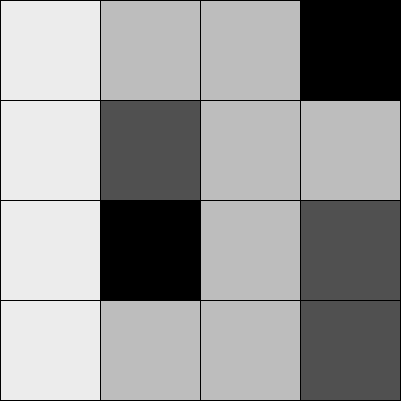
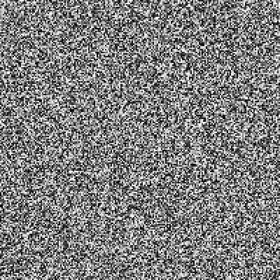
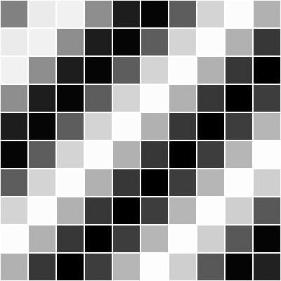

<Note>

Este tutorial es del libro [Learning Processing](https://processing.org/books/#shiffman) de Daniel Shiffman, editado por Morgan Kaufmann, © 2008 Elsevier Inc. Derechos Reservados. Si ves algún error  o tienes comentarios, por favor [ háznoslo saber](https://github.com/processing/processing-docs/issues?q=is%3Aopen).

</Note>

Un arreglo [array](http://www.processing.org/reference/Array.html) mantiene el registro de multiples piezas de información en un orden lineal, como una lista de una dimensión. Sin embargo, los datos asociados a ciertos sistemas (una imagen digital, un juego de tablero) viven en dos dimensiones. Para visualizar estos datos, necesitamos una estructura de datos multi-dimensional, es decir, un arreglo multi-dimensional. Un arreglo bidimensional no es nada más que un arreglo de arreglos. (un arreglo tridimensional es un arreglo de arreglos de arreglos). Piensa en tu cena: puedes tener una lista en una dimensión de todo lo que comes:

`(lechuga, tomates, carne, puré de papa, pastel, helado)`

O puedes tener una lista bidimensional de los tres tiempos, cada tiempo conteniendo dos cosas que comer:

`(lechuga, tomates) y (carne, puré de papas) y ( pastel, helado)`

En el caso de una rreglo, nuestro viejo amigo el arreglo de una dimensión luce así:

```
int[] myArray = {0,1,2,3};
```

y un arreglo bidimensional luce así:

```
int[][] myArray = { {0,1,2,3}, {3,2,1,0}, {3,5,6,1}, {3,8,3,4} };
```

Para nuestros propósitos, es mejor pensar un arreglo bidimensional como una matriz. Una matriz puede ser vista como una cuadrilla de números, ordenada en renglones y columnas (como un tablero de bingo). Podemos escribir el arreglo bidimensional como sigue para ilustrar este punto:

```
int[][] myArray = {  {0, 1, 2, 3},
                     {3, 2, 1, 0},
                     {3, 5, 6, 1},
                     {3, 8, 3, 4}  };
```

Podemos usar este tipo de estructura de datos para codificar información sobre una imagen. Por ejemplo, la siguiente imagen en escala de grises puede ser representada por el siguiente arreglo.

<FixedImage left width={200}>



</FixedImage>

```
int[][] myArray = {  {236, 189, 189,   0},
                     {236,  80, 189, 189},
                     {236,   0, 189,  80},
                     {236, 189, 189,  80}  };
```

Para recorrer cada elemento de un arreglo en una dimensión, usamos un ciclo for, esto es:

```
int[] myArray = new int[10];
for (int i = 0; i < myArray.length; i++) {
  myArray[i] = 0;
}
```

Para un arreglo bidimensional, para referenciar cada uno de los elementos necesitamos usar dos ciclos anidados. Esto nos dará una variable contador para cada columna y renglón en la matriz.

```
int cols = 10;
int rows = 10;
int[][] myArray = new int[cols][rows];

// Dos ciclos anidados nos permiten visitar cada sitio de un arreglo 2D.
// Por cada columna I, visita cada renglón J.
for (int i = 0; i < cols; i++) {
  for (int j = 0; j < rows; j++) {
    myArray[i][j] = 0;
  }
}
```

Por ejemplo, podemos escribir un programa usando un arreglo bidimensional para pintar una imagen en escala de grises.

<FixedImage left width={200} >



</FixedImage>

```
size(200,200);
int cols = width;
int rows = height;

// Declaramos arreglo 2D
int[][] myArray = new int[cols][rows];

// Inicializamos los valores del arreglo 2D
for (int i = 0; i < cols; i++) {
  for (int j = 0; j < rows; j++) {
    myArray[i][j] = int(random(255));
  }
}

// Dibujamos los puntos
for (int i = 0; i < cols; i++) {
  for (int j = 0; j < rows; j++) {
    stroke(myArray[i][j]);
    point(i,j);
  }
}
```
Un arreglo bidimensional también puede ser usado para almacenar objetos, lo cual es especialmente conveniente para programar sketches que involucran algún tipo de cuadrilla o tablero. El siguiente ejemplo muestra una cuadrilla de objetos Cell almacenados en un arreglo bidimensional. Cada objeto cell es un rectángulo cuyo brillo oscila entre 0 y 255 de acuerdo a una función seno.

<FixedImage left width={200} >



</FixedImage>

```
// Arreglo 2D de objetos
Cell[][] grid;

// Número de columnas y renglones en la rejilla
int cols = 10;
int rows = 10;

void setup() {
  size(200,200);
  grid = new Cell[cols][rows];
  for (int i = 0; i < cols; i++) {
    for (int j = 0; j < rows; j++) {
      // Iniciar cada objeto
      grid[i][j] = new Cell(i*20,j*20,20,20,i+j);
    }
  }
}

void draw() {
  background(0);
  // Las variables contadoras i y j son también los números de renglón y columna
  // y son usados como argumentos para el constructor de cada objeto en la cuadrilla
  for (int i = 0; i < cols; i++) {
    for (int j = 0; j < rows; j++) {
      // Oscila y despliega cada objeto
      grid[i][j].oscillate();
      grid[i][j].display();
    }
  }
}

// Un objeto Cell
class Cell {
  // Un objeto cell conoce su ubicación en la cuadrilla
  // así como su tamaño con las variables x,y,w,h
  float x,y;   // ubicación x,y
  float w,h;   // width and height (ancho y altura)
  float angle; // ángulo para oscilar el brillo

  // Constructor de Cell
  Cell(float tempX, float tempY, float tempW, float tempH, float tempAngle) {
    x = tempX;
    y = tempY;
    w = tempW;
    h = tempH;
    angle = tempAngle;
  }

  // Pscilar significa aumentar el ángulo
  void oscillate() {
    angle += 0.02;
  }

  void display() {
    stroke(255);
    // Color calculado usando la onda de seno
    fill(127+127*sin(angle));
    rect(x,y,w,h);
  }
}
```


