<Note>

  Este tutorial es el capítulo de Arreglos de [Processing: A Programming Handbook for Visual Designers and Artists, Second Edition](https://processing.org/handbook/), editado por MIT Press. &copy; 2014 MIT Press. If you see any errors or have comments, please [let us know](https://github.com/processing/processing-website/issues?state=open).

</Note>

El término arreglo se refiere a un agrupado estructurado. En programación, un arreglo es un conjunto de datos almacenados bajo el mismo nombre. Los arreglos pueden contener cualquier tipo de datos, y cada elemento puede ser individualmente asignado y leído. Puede haber arreglos de números, caracteres, enunciados, valores booleanos, etc. Los arreglos pueden contener datos de los vértices de figuras complejas, entradas de teclado, o datos leídos de un archivo. Por ejemplo, un arreglo puede almacenar cinco enteros (1919, 1940, 1975, 1976, 1990), los años en que los Cincinnati Reds ganaron la Serie Mundial, en lugar de cinco variables distintas. Llamemos a este arreglo  &ldquo;fechas&rdquo y guardemos los valores en secuencia:

<FixedImage left width={500} height={47}>


</FixedImage>

Los elementos de un arreglo son numerados empezando de cero, lo cual puede ser confuso al principio pero es un detalle importante en muchos lenguajes de programación. El primer elemento está en la posición [0], el segundo en la [1], y así sucesivamente. La posición de cad elemento es determinada por el desplazamiento con respecto al inicio del arreglo. El primer elemento está en la posición  [0] porque no hay desplazamiento. El segundo elemento esta en la posición [1] porque existe un desplazamiento de un lugar con respecto al principio. La última posicion del arreglo es calculada al restar 1 de la longitud del arreglo. En este ejemplo, el último elemento está en la posición [4] porque hay cinco elementos en el arreglo.

Los arreglos pueden hacer la labor de programar mucho más fácil. Mientras no es obligatorio su uso, ellos son estructuras valiosas para manejar datos. Empecemos con un conjunto de puntos de datos para construir una gráfica de barra.


<FixedImage center width={500} height={49}>


</FixedImage>

Los siguientes ejemplos para dibujar esta gráfica demuestran algunos de los beneficios de usar arreglos, como evitar la molesta tarea de almacenar cada dato como una variable individual. Dado que la gráfica tiene diez datos, introducir esto en un programa requiere ya sea crear 10 variables o usar un arreglo. El código de la izquierda demuestra el uso de variables separadas. El código de la derecha muestra como los datos pueden ser agrupados lógicamente en un arreglo.

```
int x0 = 50;            int[] x = { 50, 61, 83, 69, 71,
int x1 = 61;                        50, 29, 31, 17, 39 };
int x2 = 83;
int x3 = 69;
int x4 = 71;
int x5 = 50;
int x6 = 29;
int x7 = 31;
int x8 = 17;
int x9 = 39;
```

Usando lo que sabemos acerca de dibujar sin usar arreglos, se necesitan diez variables para almacenar los datos. Cada variable es usada para dibujar un simple rectángulo, lo cual es tedioso:

<FixedImage left width={100} height={100}>


</FixedImage>

```
int x0 = 50;
int x1 = 61;
int x2 = 83;
int x3 = 69;
int x4 = 71;
int x5 = 50;
int x6 = 29;
int x7 = 31;
int x8 = 17;
int x9 = 39;
fill(0);
rect(0, 0, x0, 8);
rect(0, 10, x1, 8);
rect(0, 20, x2, 8);
rect(0, 30, x3, 8);
rect(0, 40, x4, 8);
rect(0, 50, x5, 8);
rect(0, 60, x6, 8);
rect(0, 70, x7, 8);
rect(0, 80, x8, 8);
rect(0, 90, x9, 8);
```
En contraste, el siguiente ejemplo muestra como usar un arreglo en un programa. Los datos de cada barra son accesados en secuencia con un ciclo for. La sintaxis y uso de los arreglos es discutido con más detalle en las siguientes páginas.

<FixedImage left width={100} height={100}>

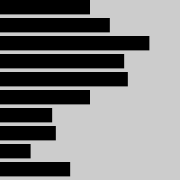

</FixedImage>

```
int[] x = {
  50, 61, 83, 69, 71, 50, 29, 31, 17, 39
};

fill(0);
//Lee un elemento del arreglo a la vez usando un ciclo for
for (int i = 0; i < x.length; i++) {
  rect(0, i*10, x[i], 8);
}
```

## Definir un Arreglo

Los arreglos son declarados de manera similar a otros tipos de datos, pero se distinguen por los paréntesis cuadrados [ y ]. Cuando un arreglo es declarado, el tipo de dato que almacena debe ser especificado (Cada arreglo sólo puede almacenar un tipo de dato). Una vez declarado, debe ser creado usando la palabra reservada new, igual que al trabajar con objetos. Este paso adicional reserva espacio en la memoria de la computadora para almacenar los datos del arreglo. Después de que el arreglo es creado, los valores pueden ser asignados. Hay diversas formas de declarar, crear y asignar arreglos. En los siguientes ejemplos explicaremos las diferencias. Un arreglo con cinco elementos es creado con valores 19, 40, 75, 76, and 90. Nota como las diferentes técnicas para crear y asignar elementos se relacionan con `setup()`.

```
int[] data; // Declarar

void setup() {
  size(100, 100);
  data = new int[5]; // Crear
  data[0] = 19; // Asignar
  data[1] = 40;
  data[2] = 75;
  data[3] = 76;
  data[4] = 90;
}

int[] data = new int[5]; // Declarar, crear

void setup() {
  size(100, 100);
  data[0] = 19; // Asignar
  data[1] = 40;
  data[2] = 75;
  data[3] = 76;
  data[4] = 90;
}

int[] data = { 19, 40, 75, 76, 90 }; // Declarar, crear, asignar

void setup() {
  size(100, 100);
}
```

Aunque cada una de los tres ejemplos previos define un arreglo de diferente manera, todos son equivalentes. Ellos muestran la flexibilidad permitida en definir los datos de un arreglo. Algunas veces, todos los datos que un programa usará son conocidos al principio y pueden ser asignados inmediatamente. En otras ocasiones, los datos son generados mientras el código se ejecuta. Cada sketch debe ser priorizado de diferente manera usando estas técnicas.

Los arreglos pueden también ser usados en programas que no incluyen `setup()` o `draw()`, pero los tres pasos de declarar, crear y asignar son necesarios. Si los arreglos no son usados con estas funciones, pueden ser creados y asignados en las formas mostradas en los siguientes ejemplos.

```
int[] data; // Declarar

data = new int[5]; // Crear

data[0] = 19; // Asignar
data[1] = 40;
data[2] = 75;
data[3] = 76;
data[4] = 90;

int[] data = new int[5]; // Declarar, crear

data[0] = 19; // Asignar

data[1] = 40;
data[2] = 75;
data[3] = 76;
data[4] = 90;

int[] data = { 19, 40, 75, 76, 90 }; // Declarar, crear, asignar
```

## Leer elementos de un Arreglo
Después de que un arreglo es definido y sus valores asignados, sus datos pueden ser accesados y usados dentro del código. Un elemento del arreglo es accesado con el nombre de la variable del arreglo, seguido por paréntesis cuadrados rodeando la posición del elemento a leer.


<FixedImage side width={100} height={100}>


</FixedImage>


```
int[] data = { 19, 40, 75, 76, 90 };

line(data[0], 0, data[0], 100);
line(data[1], 0, data[1], 100);
line(data[2], 0, data[2], 100);
line(data[3], 0, data[3], 100);
line(data[4], 0, data[4], 100);
```
Recuerda, el primer elemento del arreglo está en la posición 0. Si intentas accesar a un miembro del arreglo que esta fuera de sus límites, tu programa terminará y lanzará una excepción ArrayIndexOutOfBoundsException.

```
int[] data = { 19, 40, 75, 76, 90 };

println(data[0]); // Imprime "19" en la consola
println(data[2]); // Imprime "75" en la consola
println(data[5]); // ERROR! El último elemento del arreglo es 4
```

El campo length almacena el numero de elementos en un arreglo. Este campo es almacenado junto al arreglo y es accesador con el operador punto. (p. 363–379). El siguiente ejemplo muestra cómo utilizarlo.

```
int[] data1 = { 19, 40, 75, 76, 90 };
int[] data2 = { 19, 40 };
int[] data3 = new int[127];

println(data1.length); // Imprime "5" en la consola
println(data2.length); // Imprime "2" en la consola
println(data3.length); // Imprime "127" en la consola
```
Usualmente, un ciclo for es usado para accesar los elementos de un arreglo, especialmente en arreglos muy grandes. El siguiente ejemplo muestra las mismas líneas vistas previamente pero usa un ciclo for para iterar a través de cada valor en el arreglo.

<FixedImage side width={100} height={100}>

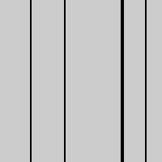

</FixedImage>


```
int[] data = { 19, 40, 75, 76, 90 };

for (int i = 0; i < data.length; i++) {
    line(data[i], 0, data[i], 100);
}
```
Un ciclo for también puede ser usado para poner datos dentro de un arreglo. Por ejemplo, puede calcular una serie de números y asignar cada valor a un elemento del arreglo. El siguiente ejemplo almacena valores de la función `sin()` en un arreglo durante la función `setup()` y muestra estos valores como el valor del trazo para las líneas durante la función `draw()`.

<FixedImage side width={100} height={100}>

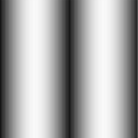

</FixedImage>


```
float[] sineWave;

void setup() {
  size(100, 100);
  sineWave = new float[width];
  for (int i = 0; i < sineWave.length; i++) {
    // Llena el arreglo con valores de sin() (seno)
    float r = map(i, 0, width, 0, TWO_PI);
    sineWave[i] = abs(sin(r));
  }
}

void draw() {
  for (int i = 0; i < sineWave.length; i++) {
    //Define los valores de pintado de acuerdo a lo que lee del arreglo
    stroke(sineWave[i] * 255);
    line(i, 0, i, height);
  }
}
```

## Almacenar datos

Un ejemplo de cómo pueden ser usados los arreglos, esta sección muestra el uso de arreglos para almacenar los datos del mouse. Las variables `pmouseX` y `pmouseY` almacenan las coordenadas del cursor en el cuadro previo, pero no hay una forma incluida para accesar los valores de cuadros previos. En cada cuadro, las variables `mouseX`, `mouseY`, `pmouseX` y `pmouseY` son reemplazadas con nuevos números y los previos descartados. Crear un arreglo es la forma más fácil de almacenar la historia de estos valores. En el siguiente ejemplo , los 100 valores más recientes de `mouseY` son almacenados y mostrados en pantalla como líneas de izquierda a derecha. En cada cuadro, los valores en el arreglo son recorridos a la derecha y el valor más reciente es agregado al principio.


<FixedImage side width={100} height={100}>

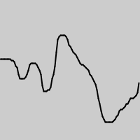

</FixedImage>

<FixedImage side width={100} height={100}>

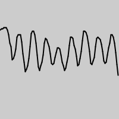

</FixedImage>

<FixedImage side width={100} height={100}>

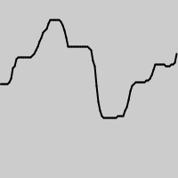

</FixedImage>


```
int[] y;

void setup() {
  size(100, 100);
  y = new int[width];
}

void draw() {
  background(204); //  Lee el arreglo de fin a principio para evitar sobreescribir los datos.
  for (int i = y.length-1; i > 0; i--) {
    y[i] = y[i-1];
  }
  // Agrega los nuevos valores al principio
  y[0] = mouseY;
  // Despliega cada par de valores como una línea
  for (int i = 1; i < y.length; i++) {
    line(i, y[i], i-1, y[i-1]);
  }
}
```

Aplica el mismo código simultáneamente a los valores `mouseX` y `mouseY` para almacenar la posición del cursor. Mostrar estos valores cada cuadro crea un rastro detrás del cursor.

<FixedImage side width={100} height={100}>

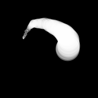

</FixedImage>

<FixedImage side width={100} height={100}>

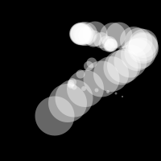

</FixedImage>

<FixedImage side width={100} height={100}>

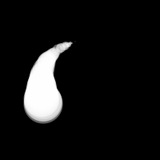

</FixedImage>


```
int num = 50;
int[] x = new int[num];
int[] y = new int[num];

void setup() {
  size(100, 100);
  noStroke();
  fill(255, 102);
}

void draw() {
  background(0);
  // Desplaza los valores a la derecha
  for (int i = num-1; i > 0; i--) {
    x[i] = x[i-1];
    y[i] = y[i-1];
  }
  //Agrega nuevos valores al inicio del arreglo
  x[0] = mouseX;
  y[0] = mouseY;
  // Dibuja los circulos
  for (int i = 0; i < num; i++) {
    ellipse(x[i], y[i], i/2.0, i/2.0);
  }
}
```

El siguiente ejemplo produce el mismo resultado que el ejemplo previo pero con una técnica más eficiente. En vez de recorrer los elementos del arreglo en cada cuadro, el programa escribe el nuevo dato en la próxima posición disponible. Los elementos en el arreglo permanecen en la misma posición, pero son leídos en un orden diferente cada cuadro. La lectura empieza en la posición del dato mas viejo y continua al final del arreglo. Al final del arreglo, el operador `%` (p. 57) es usado para regresar al inicio. Esta técnica, conocida comúnmente como un buffer de anillo, es especialmente útil en arreglos grandes para evitar copiar los datos y ralentizar el programa.


```
int num = 50;
int[] x = new int[num];
int[] y = new int[num];
int indexPosition = 0;

void setup() {
  size(100, 100);
  noStroke();
  fill(255, 102);
}

void draw() {
  background(0);
  x[indexPosition] = mouseX;
  y[indexPosition] = mouseY;
  // Alterna entre 0 y el número de elementos
  indexPosition = (indexPosition + 1) % num;
  for (int i = 0; i < num; i++) {
    // Fija la posición del arreglo a leer
    int pos = (indexPosition + i) % num;
    float radius = (num-i) / 2.0;
    ellipse(x[pos], y[pos], radius, radius);
  }
}
```

##  Funciones para Arreglos

Processing provee un grupo de funciones que ayudan a manejar los datos en los arreglos. Solo cuatro de esas funciones son presentadas aquí, pero más son explicadas en la referencia de Processing incluida con el software.

La función `append()` expande un arreglo por un elemento, agrega los datos en la nueva posición, y regresa el nuevo arreglo.

```
String[] trees = { "ash", "oak" };

append(trees, "maple"); // INCORRECTO! No cambia el arreglo
printArray(trees); // Imprime [0] "ash", [1] "oak"
println();
trees = append(trees, "maple"); // Agrega "maple" al final
printArray(trees); // Imprime [0] "ash", [1] "oak", [2] "maple"
println();
// Agrega "beech" al final del arreglo de árboles, y crea un nuevo
// arreglo para almacenar el cambio

String[] moretrees = append(trees, "beech");

// Imprime [0] "ash", [1] "oak", [2] "maple", [3] "beech"
printArray(moretrees);
```

La función `shorten()` decrementa un arreglo en un elemento al remover el último elemento y regresa el arreglo acortado:

```
String[] trees = { "lychee", "coconut", "fig" };

trees = shorten(trees); // Remueve el último elemento del arreglo.
printArray(trees); // Imprime [0] "lychee", [1] "coconut"
println();
trees = shorten(trees); // Remueve el último elemento del arreglo.
printArray(trees); // Imprime [0] "lychee"
```

La función `expand()` incrementa el tamaño de un arreglo. Puede expandirse a un tamaño específico, o sí el tamaño no es especificado, el arreglo doblará su tamaño. Si el arreglo necesita muchos elementos adicionales, es más rápido usar `expand()` para doblar su tamaño que usar `append()` para agregar continuamente un valor a la vez. El siguiente ejemplo guarda un nuevo valor de `mouseX` en un arreglo cada cuadro. Cuando el arreglo se llena, el tamaño del arreglo es doblado y nuevos valores de `mouseX` proceden a llenar el arreglo expandido.

```
int[] x = new int[100]; // Arreglo para almacenar las coordenadas en x
int count = 0; // Posiciónes guardadas
void setup() {
  size(100, 100);
}
void draw() {
  x[count] = mouseX; // Asigna una nueva coordenada en x al arreglo
  count++; // Increment the counter
  if (count == x.length) { // Si el arreglo esta lleno
    x = expand(x); // dobla el tamaño de X
    println(x.length); // Y escribe el nuevo tamaño en la consola
  }
}
```

Los valores del arreglo no pueden ser copiados con el operador de asignación puesto que son objetos. La forma más común de copiar elementos de un arreglo a otro es usar funciones especiales o copiar cada elemento individualmente dentro de un ciclo for. La función `arrayCopy()` es la manera más eficiente de copiar el contenido completo de un arreglo en otro. Los datos son copiados del arreglo usado como primer parámetro al arreglo usado como segundo parámetro. Ambos arreglos deben tener la misma longitud para que la configuración mostrada aquí funcione.


```
String[] north = { "OH", "IN", "MI" };
String[] south = { "GA", "FL", "NC" };

arrayCopy(north, south); // Copia de arreglo north a arreglo south
printArray(south); // Imprime [0] "OH", [1] "IN", [3] "MI"
println();

String[] east = { "MA", "NY", "RI" };
String[] west = new String[east.length]; // Crea un nuevo arreglo

arrayCopy(east, west); // Copia de arreglo east a arreglo west
printArray(west); // Imprime [0] "MA", [1] "NY", [2] "RI"
```

Nuevas funciones pueden ser escritas para hacer operaciones sobre los arreglos, pero los arreglos se comportan diferente que tipos de datos como `int` y `char`. Como con los objetos, cuando un arreglo es usado como parámetro de una función, la dirección de memoria es transferida dentro de la función en vez de los datos. No se crea un nuevo arreglo, y cambios creados dentro de la función afectan al arreglo usado como parámetro.

En el siguiente ejemplo, el arreglo `data[]` es usado como parámetro de `halve()`. La dirección de `data[]` es pasada al arreglo `d[]` en la función `halve()`. Puesto que la dirección de `d[]` y `data[]` es la misma, ambos apuntan a los mismos datos. Cambios hechos a `d[]` en la línea 14 modifican el valor de `data[]` durante el bloque `setup()`. La función `draw()` no es usada porque los cálculos son realizados sólo una vez y nada es dibujado en la ventana de despliegue.

```
float[] data = { 19.0, 40.0, 75.0, 76.0, 90.0 };

void setup() {
  halve(data);
  println(data[0]); // Imprime "9.5"
  println(data[1]); // Imprime "20.0"
  println(data[2]); // Imprime "37.5"
  println(data[3]); // Imprime "38.0"
  println(data[4]); // Imprime "45.0"
}
void halve(float[] d) {
  for (int i = 0; i < d.length; i++) { // por cada elemento en el arreglo
    d[i] = d[i] / 2.0; // divide el valor entre 2
  }
}
```

Cambiar los datos del arreglo dentro de una función sin modificar el arreglo original requiere algunas líneas de código adicionales. En el siguiente ejemplo, un arreglo es pasado a la función como parámetro, un nuevo arreglo es hecho, los valores del original son copiados en el nuevo arreglo, los cambios son hechos en el nuevo arreglo y finalmente el arreglo modificado es regresado.

```
float[] data = { 19.0, 40.0, 75.0, 76.0, 90.0 };
float[] halfData;
void setup() {
  halfData = halve(data); // Ejecuta la función halve() f
  println(data[0], halfData[0]); // Imprime "19.0, 9.5"
  println(data[1], halfData[1]); // Imprime "40.0, 20.0"
  println(data[2], halfData[2]); // Imprime "75.0, 37.5"
  println(data[3], halfData[3]); // Imprime "76.0, 38.0"
  println(data[4], halfData[4]); // Imprime "90.0, 45.0"
}

float[] halve(float[] d) {
  float[] numbers = new float[d.length]; // Crea un nuevo arreglo
  arrayCopy(d, numbers);
  for (int i = 0; i < numbers.length; i++) { // Por cada elemento del arreglo
    numbers[i] = numbers[i] / 2.0; // divide el valor entre 2
  }
  return numbers; // Regresa el nuevo arreglo
}
```

## Arreglo de Objects (Objetos)

Trabajar con arreglos de objetos es técnicamente similar a trabajar con arreglos de otros tipos de datos, pero abre la maravillosa posibilidad de crear tantas instancias de una clase diseñada a la medida como se quiera. Como todos los arreglos, un arreglo de objetos se distingue como un solo objeto con paréntesis cuadrados [ y ] . Sin embargo, puesto que cada elemento del arreglo es un objeto, cada uno debe ser creado con la palabra reservada new antes de poder ser usado. Los pasos para trabajar con un arreglo de objetos son:

1. Declarar el arreglo

2. Crear el arreglo

3. Crear cada objeto en el arreglo

Estos pasos son traducidos a código en el siguiente ejemplo. Usa la clase Ring de la página 371, así que copiala. Este código crea un arreglo `rings[]` para contener cincuenta  objetos `Ring` . El espacio en memoria para el arreglo `rings[]` es reservado en `setup()` y cada objeto `Ring` es creado. La primera vez que un botón de mouse es presionado, el primer objeto `Ring` es encendido y sus variables `x` y `y` son asignadas al valor actual del cursor. Cada vez que un botón de mouse es presionado, un nuevo `Ring` es encendido y desplegado en `draw()`. Cuando el elemento final del arreglo ha sido creado, el programa salta al inicio del arreglo para asignar nuevas posiciones a `Rings` previos.

<FixedImage side width={100} height={100}>

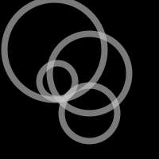

</FixedImage>

<FixedImage side width={100} height={100}>

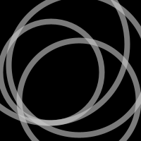

</FixedImage>

<FixedImage side width={100} height={100}>

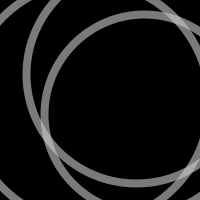

</FixedImage>


```
Ring[] rings; // Declarar el arreglo
int numRings = 50;
int currentRing = 0;
void setup() {
  size(100, 100);
  rings = new Ring[numRings]; // Crear el arreglo
  for (int i = 0; i < rings.length; i++) {
    rings[i] = new Ring(); // Crear cada objeto
  }
}
void draw() {
  background(0);
  for (int i = 0; i < rings.length; i++) {
    rings[i].grow();
    rings[i].display();
  }
}
// Click para crear un nuevo Ring
void mousePressed() {
  rings[currentRing].start(mouseX, mouseY);
  currentRing++;
  if (currentRing >= numRings) {
    currentRing = 0;
  }
}
class Ring {
  float x, y;          // Coordenada x, Coordenada y
  float diameter;      // Diametro de la figura
  boolean on = false;  // Enciende o apaga el despliegue en pantalla

  void start(float xpos, float ypos) {
    x = xpos;
    y = ypos;

    diameter = 1;
    on = true;
  }

  void grow() {
    if (on == true) {
      diameter += 0.5;
      if (diameter > 400) {
        on = false;
        diameter = 1;
      }
    }
  }

  void display() {
    if (on == true) {
      noFill();
      strokeWeight(4);
      stroke(204, 153);
      ellipse(x, y, diameter, diameter);
    }
  }
}
```
El siguiente ejemplo requiere la clase `Spot` de la página 363. A diferencia del ejemplo previo, los valores de las variables son generados dentro del `setup()` y son pasados a cada elemento de los arreglos a través del constructor del objeto. Cada elemento en el arreglo empieza con un conjunto único de coordenada en x, diametro y velocidad. Puesto que el número de objetos es dependiente de el ancho de la ventana de despliegue en la pantalla, no es posible crear el arreglo hasta que el programa sepa que tan ancha será la pantalla. Por lo tanto, el arreglo es declarado afuera de `setup()` para hacerlo global (Ver p. 12), pero es creado adentro del `setup()`, después de que la ventana de despliegue es definida.

<FixedImage center width={700} height={100}>


</FixedImage>

<FixedImage center width={700} height={100}>


</FixedImage>


```
Spot[] spots; // Declarar arreglo
void setup() {
  size(700, 100);
  int numSpots = 70; // Número de objetos
  int dia = width/numSpots; // Calcular diametro
  spots = new Spot[numSpots]; // Crear arreglo
  for (int i = 0; i < spots.length; i++) {
    float x = dia/2 + i*dia;
    float rate = random(0.1, 2.0);
    // Crear cada objeto
    spots[i] = new Spot(x, 50, dia, rate);
  }
  noStroke();
}
void draw() {
  fill(0, 12);
  rect(0, 0, width, height);
  fill(255);
  for (int i=0; i < spots.length; i++) {
    spots[i].move(); // Mover cada objeto
    spots[i].display(); // Desplegar cada objeto
  }
}
class Spot {
  float x, y;         // Coordenada x, coordenada y
  float diameter;     // Diametro del circulo
  float speed;        // Distancia que se mueve cada cuadro
  int direction = 1;  // Dirección de movimiento(1 es abajo, -1 es arriba)

  // Constructor
  Spot(float xpos, float ypos, float dia, float sp) {
    x = xpos;
    y = ypos;
    diameter = dia;
    speed = sp;
  }

  void move() {
    y += (speed * direction);
    if ((y > (height - diameter/2)) || (y < diameter/2)) {
      direction *= -1;
    }
  }

  void display() {
    ellipse(x, y, diameter, diameter);
  }
}
```
Trabajar con arreglos nos da la oportunidad de acceder a cada objeto con una estructura de código llamada ciclo for mejorado que simplifica el código.  A diferencia del ciclo for usado previamente, el ciclo mejorado recorre cada elemento del arrego uno por uno sin necesidad de definir condiciones de inicio o fin. Un ciclo mejorado se estructura a través de declarar el tipo de datos de los elementos del arreglo, un nombre de variable a asignar a cada elemento del arreglo y el nombre del arreglo. Por ejemplo, el ciclo for del ejemplo anterior es reescrito de la siguiente forma:

```
for (Spot s : spots) {
  s.move();
  s.display();
}
```
Cada objeto en el arreglo es asignado a la variable `s`, así que la primera vez a través del ciclo, el codigo `s.move()` ejecuta el método `move()` para el primer elemento del arreglo, y la siguiente vez dentro del ciclo `s.move()` lo hará para el segundo elemento, etc. Las dos declaraciones dentro del bloque se ejecutarán para cada elemento del arreglo hasta el fin del mismo. Esta forma de accesar cada elemento en un arreglo de objetos se usará en el libro.

## Arreglos Bidimensionales

Los datos también pueden ser almacenados y recuperados de arreglos con más de una dimensión. Usando el ejemplo del principio del tutorial, los puntos de datos para la gráfica son puestos en un arreglo 2D, donde la segunda dimensión agrega un valor de grises:

<FixedImage center width={500} height={70}>


</FixedImage>

Un arreglo 2D es esencialmente una lista de arreglos 1D. Primero tiene que ser declarado, después creado , y entonces los valores pueden ser asignados, igual que en un arreglo 1D. La siguiente sintaxis convierte el diagrama de arriba en código:


```
int[][] x = { {50, 0}, {61,204}, {83,51}, {69,102}, {71, 0},
{50,153}, {29, 0}, {31,51}, {17,102}, {39,204} };

println(x[0][0]); // Imprime "50"
println(x[0][1]); // Imprime "0"
println(x[4][2]); // ERROR! Este elemento esta afuera del arreglo
println(x[3][0]); // Imprime "69"
println(x[9][1]); // Imprime "204"
```

Este sketch muestra como todo se ensambla.

<FixedImage side width={100} height={100}>

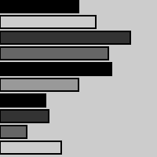

</FixedImage>


```
int[][] x = { {50, 0}, {61,204}, {83,51}, {69,102},
{71, 0}, {50,153}, {29, 0}, {31,51},
{17,102}, {39,204} };

void setup() {
  size(100, 100);
}
void draw() {
  for (int i = 0; i < x.length; i++) {
    fill(x[i][1]);
    rect(0, i*10, x[i][0], 8);
  }
}
```

Es posible continuar y hacer arreglos en 3D y 4D al extrapolar estas técnicas. Sin embargo, los arreglos multidimensionales pueden ser confusos, y generalmente es mejor idea mantener múltiples arreglos en 1D o 2D.
