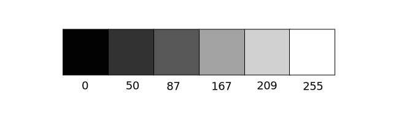
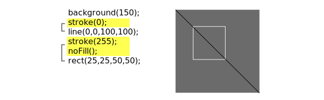

<Note>

This tutorial is from the book [Learning Processing](https://processing.org/books/#shiffman) by Daniel Shiffman, published by Morgan Kaufmann, © 2008 Elsevier Inc. All rights reserved. If you see any errors or have comments, [please let us know](https://github.com/processing/processing-docs/issues?q=is%3Aopen).

</Note>

In the digital world, when we want to talk about a color, precision is required. Saying &ldquo;Hey, can you make that circle bluish-green?&rdquo;  will not do. Color, rather, is defined as a range of numbers. Let's start with the simplest case:  black & white or grayscale.   0 means black, 255 means white. In between, every other number&mdash;50, 87, 162, 209, and so on&mdash;is a shade of gray ranging from black to white.

<FixedImage center width={645} height={200}>



</FixedImage>

<HighlightBlock>

*Does 0-255 seem arbitrary to you?*

Color for a given shape needs to be stored in the computer's memory. This memory is just a long sequence of 0's and 1's (a whole bunch of on or off switches.) Each one of these switches is a bit, eight of them together is a byte. Imagine if we had eight bits (one byte) in sequence&mdash;how many ways can we configure these switches? The answer is (and doing a little [research into binary numbers](http://en.wikipedia.org/wiki/Binary_number) will prove this point) 256 possibilities, or a range of numbers between 0 and 255. We will use eight bit color for our grayscale range and 24 bit for full color (eight bits for each of the red, green, and blue color components).

</HighlightBlock>

By adding the [**stroke()**](http://processing.org/reference/stroke_.html) and [**fill()**](http://processing.org/reference/fill_.html) functions before something is drawn, we can set the color of any given shape.  There is also the function [**background()**](http://processing.org/reference/background_.html), which sets a background color for the window. Here's an example.

```
size(200, 200);
background(255);    // Setting the background to white
stroke(0);          // Setting the outline (stroke) to black
fill(150);          // Setting the interior of a shape (fill) to grey
rect(50,50,75,100); // Drawing the rectangle
```

Stroke or fill can be eliminated with the functions: [**noStroke()**](http://processing.org/reference/noStroke_.html) and [**noFill()**](http://processing.org/reference/noFill_.html). Our instinct might be to say &ldquo;`stroke(0)`&rdquo; for no outline, however, it is important to remember that 0 is not &ldquo;nothing&rdquo;, but rather denotes the color black. Also, remember not to eliminate both&mdash;with `noStroke()` and `noFill()`, nothing will appear!

In addition, if we draw two shapes, Processing will always use the most recently specified stroke and fill, reading the code from top to bottom.

<FixedImage center width={645} height={300}>



</FixedImage>

## RGB Color

Remember finger painting? By mixing three &ldquo;primary&rdquo; colors, any color could be generated.  Swirling all colors together resulted in a muddy brown. The more paint you added, the darker it got. Digital colors are also constructed by mixing three primary colors, but it works differently from paint.  First, the primaries are diff erent: red, green, and blue (i.e.,  &ldquo;RGB&rdquo;  color). And with color on the screen, you are mixing light, not paint, so the mixing rules are different as well.


- Red	+ Green = Yellow
- Red	+ Blue 	= Purple
- Green + Blue = Cyan (blue-green)
- Red	+ Green + Blue = White
- No colors = Black

This assumes that the colors are all as bright as possible, but of course, you have a range of color available, so some red plus some green plus some blue equals gray, and a bit of red plus a bit of blue equals dark purple.  While this may take some getting used to, the more you program and experiment with RGB color, the more it will become instinctive, much like swirling colors with your fi ngers. And of course you can't say  &ldquo;Mix some red with a bit of blue,&rdquo; you have to provide an exact amount. As with grayscale, the individual color elements are expressed as ranges from 0 (none of that color) to 255 (as much as possible), and they are listed in the order R, G, and B. You will get the hang of RGB color mixing through experimentation, but next we will cover some code using some common colors.

[Example: RGB color](http://learningprocessing.com/examples/chp01/example-01-03-rgbcolor)

<FixedImage side width={102} height={102}>


</FixedImage>

```
background(255);
noStroke();

// Bright red
fill(255,0,0);
ellipse(20,20,16,16);

// Dark red
fill(127,0,0);
ellipse(40,20,16,16);

// Pink (pale red)
fill(255,200,200);
ellipse(60,20,16,16);
```

Processing also has a color selector to aid in choosing colors. Access this via Tools (from the menu bar) &rarr; Color Selector.

<FixedImage center width={428} height={306}>


</FixedImage>

## Color Transparency

In addition to the red, green, and blue components of each color, there is an additional optional fourth component, referred to as the color's  &ldquo;alpha.&rdquo;  Alpha means transparency and is particularly useful when you want to draw elements that appear partially see-through on top of one another. The alpha values for an image are sometimes referred to collectively as the &ldquo;alpha channel&rdquo; of an image.

It is important to realize that pixels are not literally transparent, this is simply a convenient illusion that is accomplished by blending colors. Behind the scenes,  Processing  takes the color numbers and adds a percentage of one to a percentage of another, creating the optical perception of blending. (If you are interested in programming  &ldquo;rose-colored&rdquo; glasses, this is where you would begin.)

Alpha values also range from 0 to 255, with 0 being completely transparent (i.e., 0% opaque) and 255 completely opaque (i.e., 100% opaque).

[Example: Alpha transparency](http://learningprocessing.com/examples/chp01/example-01-04-alpha)

<FixedImage side width={200} height={200}>


</FixedImage>

```
size(200,200);
background(0);
noStroke();

// No fourth argument means 100% opacity.
fill(0,0,255);
rect(0,0,100,200);

// 255 means 100% opacity.
fill(255,0,0,255);
rect(0,0,200,40);

// 75% opacity.
fill(255,0,0,191);
rect(0,50,200,40);

// 55% opacity.
fill(255,0,0,127);
rect(0,100,200,40);

// 25% opacity.
fill(255,0,0,63);
rect(0,150,200,40);
```

## Custom Color Ranges

RGB color with ranges of 0 to 255 is not the only way you can handle color in Processing. Behind the scenes in the computer's memory, color is  always talked about as a series of 24 bits (or 32 in the case of colors with an alpha). However, Processing  will let us think about color any way we like, and translate our values into numbers the computer understands. For example, you might prefer to think of color as ranging from 0 to 100 (like a percentage). You can do this by specifying a custom [**colorMode()**](http://processing.org/reference/colorMode_.html).

```
colorMode(RGB,100);
```

The above function says: &ldquo;OK, we want to think about color in terms of red, green, and blue. The range of RGB values will be from 0 to 100.&rdquo;

Although it is rarely convenient to do so, you can also have different ranges for each color component:

```
colorMode(RGB,100,500,10,255);
```

Now we are saying &ldquo;Red values go from 0 to 100, green from 0 to 500, blue from 0 to 10, and alpha from 0 to 255.&rdquo;

Finally, while you will likely only need RGB color for all of your programming needs, you can also specify colors in the HSB (hue, saturation, and brightness) mode. Without getting into too much detail, HSB color works as follows:

<FixedImage center width={250} height={200}>


</FixedImage>

- **Hue** - The color type, ranges from 0 to 255 by default.
- **Saturation** - The vibrancy of the color, 0 to 255 by default.
- **Brightness** - The, well, brightness of the color, 0 to 255 by default.

With [**colorMode()**](http://processing.org/reference/colorMode_.html) you can set your own ranges for these values. Some prefer a range of 0-360 for hue (think of 360 degrees on a color wheel) and 0-100 for saturation and brightness (think of 0-100%).
