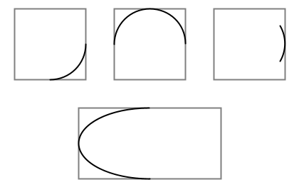
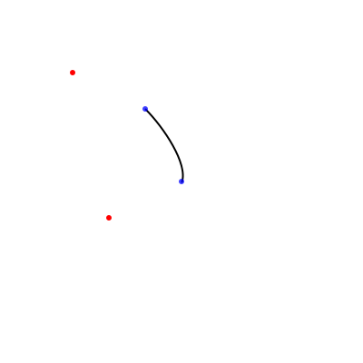
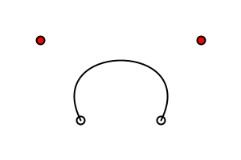
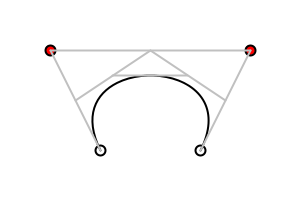
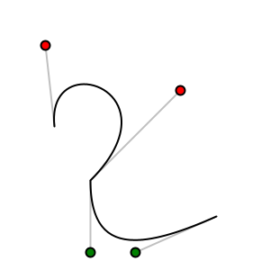
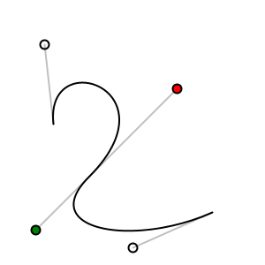

<Note>

If you see any errors in this tutorial or have comments, please [let us know](https://github.com/processing/processing-docs/issues?state=open). This work is licensed under a [Creative Commons Attribution-NonCommercial-ShareAlike 4.0 International License](http://creativecommons.org/licenses/by-nc-sa/4.0/).

</Note>

This short tutorial introduces you to the three types of curves in Processing: arcs, spline curves, and B&eacute;zier curves.

## Arcs

Arcs are the simplest curves to draw. Processing defines an arc as a section of an ellipse. You call the function with these parameters:

```
arc(x, y, width, height, start, stop);
```

The first four parameters are the same as the ones for `ellipse()`; they define the boundary box for your arc. The last two parameters are the starting and ending
angle for the arc. These angles, as with all other angles in Processing, are given
in radians. Remember that angles are measured clockwise, with zero degrees pointing
east. Using the fact that `PI` radians equals 180&deg;, here are some example arcs.

<FixedImage side width={210} height={132}>



</FixedImage>


```
void setup() {
  size(300, 200);
  background(255);
  smooth();
  
  rectMode(CENTER); // show bounding boxes
  stroke(128);
  rect(35, 35, 50, 50);
  rect(105, 35, 50, 50);
  rect(175, 35, 50, 50);
  rect(105, 105, 100, 50);
  
  stroke(0);
  arc(35, 35, 50, 50, 0, PI / 2.0); // lower quarter circle 
  arc(105, 35, 50, 50, -PI, 0);  // upper half of circle
  arc(175, 35, 50, 50, -PI / 6, PI / 6); // 60 degrees
  arc(105, 105, 100, 50, PI / 2, 3 * PI / 2); // 180 degrees
}
```

## Spline Curves

Arcs are fine, but they're plain. The next function, `curve()`, lets you draw curves that aren't necessarily part of an arc. This function draws what is technically called a <dfn>Rom-Catmull Spline</dfn>. To draw the curve, you have to specify the (x, y) coordinates of the points where the curve starts and ends. You must also specify two <dfn>control points</dfn> which determine the direction and amount of curvature. A call to `curve()` uses these parameters:
  
```
curve(cpx1, cpy1, x1, y1, x2, y2, cpx2, cpy2);
```

- **cpx1, cpy1** - Coordinates of the first control point
- **x1, y1** - Coordinates of the curve's starting point
- **x2, y2** - Coordinates of the curve's ending point
- **cpx2, cpy2** - Coordinates of the second control point

Here is an example that shows a `curve()`. The control
points are shown in red and the curve points in blue.

<FixedImage side width={118} height={126}>



</FixedImage>


```
void setup() {
  size(200, 200);
  background(255);
  smooth();
  stroke(0);
  curve(40, 40, 80, 60, 100, 100, 60, 120);
  noStroke();
  fill(255, 0, 0);
  ellipse(40, 40, 3, 3);
  fill(0, 0, 255, 192);
  ellipse(100, 100, 3, 3);
  ellipse(80, 60, 3, 3);
  fill(255, 0, 0);
  ellipse(60, 120, 3, 3);  
}
```

How do the control points affect the way the curve looks? Take a deep breath, because this is somewhat complicated.

- The tangent to the curve at the start point is parallel to the line between control point one and the end of the curve. These are the lines shown in green in the diagram at the left.
- The tangent to the curve at the end point is parallel to the line between the start point and control point 2. These are the lines shown in purple in the diagram at the left.

## Continuous Spline Curves

In isolation, a single `curve()` is not particularly appealing. To draw a continuous curve through several points, you are better off using the `curveVertex()` function. You can only use this function when you are creating a shape with the `beginShape()` and `endShape()` functions.

Here is a curve connecting the points (40, 40), (80, 60), (100, 100), (60, 120), and (50, 150). In common usage, people use the first point of the curve as the first control point and the last point of the curve as the last control point. 

<FixedImage side width={119} height={140}>


</FixedImage>


```
int[] coords = {
  40, 40, 80, 60, 100, 100, 60, 120, 50, 150
};

void setup() {
  size(200, 200);
  background(255);
  smooth();

  noFill();
  stroke(0);
  beginShape();
  curveVertex(40, 40); // the first control point
  curveVertex(40, 40); // is also the start point of curve
  curveVertex(80, 60);
  curveVertex(100, 100);
  curveVertex(60, 120);
  curveVertex(50, 150); // the last point of curve
  curveVertex(50, 150); // is also the last control point
  endShape();

  // Use the array to keep the code shorter;
  // you already know how to draw ellipses!
  fill(255, 0, 0);
  noStroke();
  for (int i = 0; i < coords.length; i += 2) {
    ellipse(coords[i], coords[i + 1], 3, 3);
  }
}
```

## B&eacute;zier Curves

Though better than arcs, spline curves don't seem to have those graceful, swooping curves that say &ldquo;art.&rdquo; For those, you need to draw B&eacute;zier curves with the `bezier()` function. As with spline curves, the `bezier()` function has eight parameters, but the order is different:
  
```
bezier(x1, y1, cpx1, cpy1, cpx2, cpy2, x2, y2);
```

- **x1, y1** - Coordinates of the curve's starting point
- **cpx1, cpy1** - Coordinates of the first control point
- **cpx2, cpy2** - Coordinates of the second control point
- **x2, y2** - Coordinates of the curve's ending point

Here is a program that displays a B&eacute;zier curve and its control points.

<FixedImage side width={154} height={99}>



</FixedImage>


```
void setup() {
  size(150, 150);
  background(255);
  ellipse(50, 75, 5, 5); // endpoints of curve
  ellipse(100, 75, 5, 5);
  fill(255, 0, 0);
  ellipse(25, 25, 5, 5);  // control points
  ellipse(125, 25, 5, 5); 
  noFill();
  stroke(0);
  bezier(50, 75, 25, 25, 125, 25, 100, 75);
}
```

While it is difficult to visualize how the control points affect a `curve()`, it is slightly easier to see how the control points affect B&eacute;zier curves. Imagine two poles and several rubber bands.  The poles connect the control points to the endpoints of the curve. A rubber band connects the tops of the poles.  Two more rubber bands connect the midpoints of the poles to the midpoint of the first rubber band. One more rubber band connects *their* midpoints. The center of that last rubber band is tied to the curve. This diagrams helps to explain:

<FixedImage center width={154} height={99}>



</FixedImage>

## Continuous B&eacute;zier Curves

Just as `curveVertex()` allows you to make continuous spline curves, `bezierVertex()` lets you make continuous B&eacute;zier curves. Again, you must be within a `beginShape()` / `endShape()` sequence. You must use `vertex(startX, startY)` to specify the starting point of the curve. Subsequent points are specified with a call to:
  
```
bezierVertex(cpx1, cpy1, cpx2, cpy2, x, y);
```

- **cpx1, cpy1** - Coordinates of the first control point
- **cpx2, cpy2** - Coordinates of the second control point
- **x, y** - The next point on the curve 

So, to draw the previous example using `bezierVertex()`, you would do this:

```
void setup() {
  size(150, 150);
  background(255);
  smooth();
  // Don't show where control points are
  noFill();
  stroke(0);
  beginShape();
  vertex(50, 75); // first point
  bezierVertex(25, 25, 125, 25, 100, 75);
  endShape();
}
```

Here is a continuous B&eacute;zier curve, but it doesn't join smoothly. The diagram shows the control points, but only the relevant code for drawing the curve is here.

<FixedImage side width={136} height={136}>



</FixedImage>


```
size(200, 200);
background(255);
noFill();
beginShape();
vertex(30, 70); // first point
bezierVertex(25, 25, 100, 50, 50, 100);
bezierVertex(50, 140, 75, 140, 120, 120);
endShape();
```

In order to make two curves A and B smoothly continuous, the last control point of A, the last point of A, and the first control point of B have to be on a straight line.  Here is an example that meets those conditions. The points that are in a line are shown in bold.

<FixedImage side width={132} height={132}>



</FixedImage>


```
size(200, 200);
background(255);
beginShape();
vertex(30, 70); // first point
bezierVertex(25, 25, 100, 50, 50, 100);
bezierVertex(20, 130, 75, 140, 120, 120);
endShape();
```


## Summary

- Use `arc()` when you need a segment of a circle or an ellipse. You can't make continuous arcs or use them as part of a shape.
- Use `curve()` when you need a small curve between two points. Use `curveVertex()` to make a continuous series of curves as part of a shape.
- Use `bezier()` when you need long, smooth curves. Use `bezierVertex()` to make a continuous series of B&eacute;zier curves as part of a shape.
