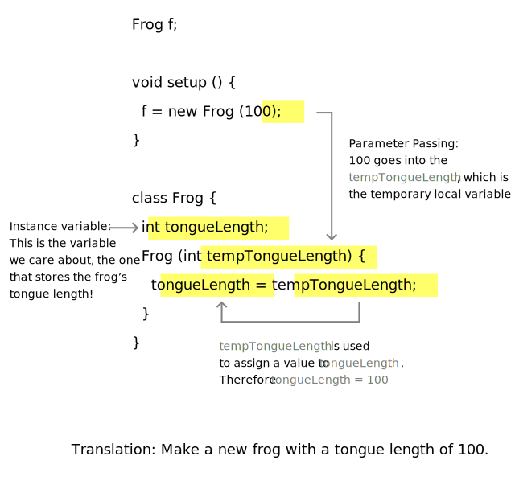

<Nota>

  Este tutorial es del libro [Learning Processing](https://processing.org/books/#shiffman) de Daniel Shiffman, editado por Morgan Kaufmann, © 2008 Elsevier Inc. Todos los derechos reservados. Si ves algún error o tienes comentarios, [por favor háznoslo saber](https://github.com/processing/processing-website/issues?q=is%3Aopen).

</Nota>

Antes de que examinemos los detalles de como la programación orientada a objetos (POO) funciona en Processing, embarquémonos en una corta discusión conceptual de que es un  &ldquo;objeto&rdquo; . Imagina que no estás programando en Processing, pero que en realidad estás escribiendo un programa para tu día: una lista de instrucciones si tú quieres. Podría empezar de una forma parecida a esto:

- Despertar
- Beber café (o té)
- Desayunar: cereal, moras azules y leche de soya
- Tomar el transporte público

¿Qué cosas están involucradas en esto? Primero, aunque no parezca inmediatamente aparente por como escribimos las instrucciones de arriba, lo principal es que tú eres un ser humano, una persona. Tú exhibes ciertas propiedades. Tú luces de cierta forma. Tal vez tengas cabello café, uses lentes y parezcas nerd ligeramente. Tú también tienes la habilidad de hacer cosas como despertarte (presumiblemente, tú también puedes dormir), comer, o tomar transporte. Un objeto es justo como tú, una cosa que tiene propiedades y puede hacer cosas.

Mapeemos los datos y funciones para un simple objeto humano:

**Datos del Humano**

- Altura
- Peso
- Género
- Color de ojos
- Color de cabello

**Funciones del Humano **

- Dormir
- Despertar
- Comer
- Tomar alguna forma de transporte

Ahora, antes de ir mucho más lejos, necesitamos embarcarnos en un pequeño desvío metafísico. La estructura de arriba no es un ser humano por sí mismo; simplemente describe la idea o el concepto detrás de un ser humano. Describe qué es ser humano. Ser humano es tener altura, peso, cabello, dormir, comer, etc. Esto es una distinción crucial para los objetos de programación. Esta plantilla de seres humanos es conocida como _clase_. Una _clase_ es diferente de un _objeto_. Tú eres un objeto, yo soy un objeto. Aquel tipo en el transporte es un objeto. Albert Einstein es un objeto. Todos somos personas, _instancias_ en el mundo real de la idea de un ser humano.

Piensa en un cortador de galletas. Un cortador de galletas hace galletas, pero no es una galleta en si misma. El cortador de galletas es la _clase_, las galletas son los _objetos_.


## Usando un Objeto

Antes de que veamos la escritura de una clase, miremos brevemente como usar objetos en nuestro programa (por ejemplo, `setup()` y `draw()`) hace al mundo un mejor lugar.

Considera el pseudo-código de un sketch simple para mover un rectángulo horizontalmente a lo largo de la ventana ( pensaremos en este rectángulo como un &ldquo;carro&rdquo;).


**Datos (Variables Globales)**

- Color del carro.
- Ubicación en X del carro.
- Ubicación en Y del carro.
- Velocidad en X del carro.

**Configuración**:

- Inicializar el color del carro.
- Inicializar la posición del carro a sus ubicaciones iniciales.
- Inicializar la velocidad del carro.

**Dibujar**:

- Llenar el fondo.
- Desplegar el carro en la ubicación adecuada y con color.
- Incrementar la ubicación del carro de acuerdo a la velocidad.

Para implementar el pseudo-código de arriba, necesitamos definir las variables globales al inicio del programa, inicializar los valores en `setup()`, y llamar funciones para mover y desplegar el carro en `draw()`. Algo como:

```
color c = color(0);
float x = 0;
float y = 100;
float speed = 1;

void setup() {
  size(200,200);
}

void draw() {
  background(255);
  move();
  display();
}

void move() {
  x = x + speed;
  if (x > width) {
    x = 0;
  }
}

void display() {
  fill(c);
  rect(x,y,30,10);
}
```

La programación orientada a objetos nos permite tomar todas las variables y funciones fuera del programa principal y almacenarlas dentro de un objeto carro. Un objeto carro conocerá sus datos _color_, _location_, _speed_. El objeto también sabrá las _cosas que puede hacer_, los métodos (funciones dentro de un objeto)— el carro puede _manejar_ y puede ser _desplegado_.


Usando un diseño orientado a objetos, el pseudo-código luce mejor:

**Datos (Variables Globales)**:

- Objeto Carro.

**Configuración**:

- Inicializar objeto carro.

**Dibujar**:

- Llenar fondo.
- Desplegar objeto carro.
- Manejar objeto carro.

Nota que removimos todas las variables globales del primer ejemplo. En vez de tener variables separadas para el color, la ubicación y la velocidad del carro, ahora tenemos sólo una variable Carro. Además, en vez de inicializar 3 variables, inicializamos una cosa: el objeto Carro. ¿A donde se fueron esas variables? Ellas aún existen, solamente que ahora viven dentro del objeto Carro ( y serán definidas en la clase Car, que presentaremos en un momento).

Moving beyond pseudocode, the actual body of the sketch might look like:

```
Car myCar;

void setup()  {
  myCar = new Car();
}

void draw()  {
  background(255);
  myCar.drive();
  myCar.display();
}
```

Vamos a ir a los detalles respecto al código de arriba en un momento, pero antes de ir a eso, echemos un vistazo y miremos como la clase Car es escrita.

## Escribiendo el cortador de galletas

El ejemplo de la clase Car demuestra como el uso de objetos en Processing ayuda a tener código limpio y legible. El trabajo duro va en escribir la plantilla de objetos — esto es, la clase misma. Al principio, cuando estás aprendiendo programación orientada a objetos, usualmente es un ejercicio útil tomar un programa escrito sin objetos y, sin cambiar la funcionalidad, reescribirlo usando objetos. Nosotros haremos esto exactamente con el ejemplo del Car, recreando exactamente cómo se ve y cómo se comporta en una version orientada a objetos.

Todas las clases deben incluir cuatro elementos: nombre, datos, constructor y métodos.(Técnicamente, el único elemento requerido es el nombre de la clase, pero el punto de hacer programación orientada a objetos es incluir todos ellos)

Así es como podemos tomar los elementos de un sketch simple no orientado a objetos y colocarlos dentro de una clase Car, a partir de la cual podremos hacer objetos Car.

<FixedImage center width={642} height={690}>


</FixedImage>

**Nombre de la Clase**: El nombre es especificado por &ldquo;class EscogeElNombreQueQuieras&rdquo;. Entonces rodeamos todo el código de la clase dentro de llaves ({}) tras la declaración del nombre. Los nombres de clases normalmente empiezan con mayúsculas (para distinguirlos de los nombres de variables, que tradicionalmente empiezan con minúsculas).

**Datos**: Los datos de una clase son una colección de variables. Estas variables son usualmente referidas como variables de la instancia dado que cada instancia de un objeto contiene este conjunto de variables.

**Constructor**: El constructor es una función especial dentro de la clase que crea la instancia del objeto. Es aquí donde das las instrucciones sobre como configurar el objeto. Es como la función `setup()` de Processing, sólo que aui es usado para crear objetos individuales dentro del sketch, cuando un nuevo objeto es creado de esta clase. Siempre tiene el mismo nombre de la clase y es llamado al invocar el operador new: `Car myCar = new Car();`.

**Functionalidad**: Podemos agregar funcionalidad a nuestros objetos al escribir métodos.

Nota que el código de una clase existe en su propio bloque y puede ser colocado en cualquier sitio afuera de `setup()` y `draw()`.

```
void setup() {

}

void draw() {

}

class Car {

}
```

## Usando un Objeto: los Detalles

Antes, nosotros echamos un vistazo rápido a como un objeto puede simplificar las partes principales de un sketch de Processing (`setup()` y `draw()`).


```
// Paso 1. Declara an objeto.
Car myCar;

void setup()  {
  // Paso 2. Inicializar objeto.
  myCar = new Car();
}

void draw()  {
  background(255);
  // Paso 3. Llamar los métodos del objeto.
  myCar.drive();
  myCar.display();
}
```

Miremos los detalles detrás de los tres pasos de arriba mostrando como usar un objeto en tu sketch.


**Paso 1. Declarar una variable objeto.**

Una variable es siempre declarada al especificar el tipo y un nombre. Con un tipo de dato primitivo, como un entero, luce así:

```
// Declaración de variable
int var;  // tipo y nombre
```

Los tipos de datos primitivos son piezas singulares de información: un entero, un decimal de punto flotante(float), un caracter(char), etc. declara una variable que guardara un objeto es bastante similar. La diferencia es que aquí el tipo es el nombre de la clase, algo que nosotros decidimos, en este caso &ldquo;Car.&rdquo; , Los objetos, incidentalmente, no son primitivos y son considerados tipos de datos complejos. ( Esto es porque contienen multiples piezas de información: datos y funcionalidad. Los datos primitivos sólo almacenan datos)

**Paso 2. Inicializando un objeto.**

Para inicializar una variable (es decir, darle un valor inicial), usamos una operación de asignación - la variable igual a algo. Con un tipo de dato primitivo como un entero, esto luce así:

```
// Inicialización de la variable
var = 10;  // var igual a 10
```

Inicializar un objeto es un poco más complicado. En vez de simplemente asignar un valor, como con los enteros o los números de punto flotante, ahora tenemos que construir un objeto. Un objeto es hecho con el operador **_new_**.

```
// Inicialización de objetos
myCar = new Car(); // El operador new es usado para hacer un nuevo objeto
```

En el ejemplo de arriba, &ldquo;myCar&rdquo; es el nombre del objeto variable e &ldquo;=&rdquo; indica que estamos asignándolo a algo, siendo ese algo una nueva instancia de un objeto Car. Lo que está pasando aquí es que estamos inicializando un objeto Car. Cuando inicializas una variable primitiva, como un entero, tú sólo la igualas a un número. Pero un objeto puede contener multiples piezas de datos. Volviendo a la clase Car, nosotros vemos que esta línea de código llama al _constructor_, una función especial llamada **Car()** que inicializa todas las variables del objeto y se asegura que el objeto de tipo Car este listo para ser usado.
Otra cosas: con un entero primitivo &ldquo;var,&rdquo; si se te olvida inicializarlo (digamos, asignarle 10), Processing hubiera signado el valor default - cero. Un objeto (tal como &ldquo;myCar&rdquo;), sin embargo, no tiene valor default. Si tu olvidas inicializar un objeto, Processing le dara el valor _null_. _null_ significa nada. No cero, no uno negativo. La más absoluta nada. Si tú encuentras un error en la ventana de mensajes que dice &ldquo;NullPointerException&rdquo; ( y este es un error muy común), este error es muy probablemente causado a haber olvidado inicializar un objeto.


**Paso 3. Usar un objeto.**

Una vez que hemos declarado e inicializado exitosamente una variable objeto, podemos usarlo. Usar un objeto involucra llamar funciones que están construidas dentro de ese objeto. Un objeto humano puede comer, un carro puede manejar, un perro puede ladrar. Llamar a una función dentro de un objeto es logrado a través de la sintaxis de punto: nombreDeVariable.FuncionDelObjeto(Argumentos );


En el caso del carro, ninguna de las funciones tiene parámetros, asi que luce así:

```
// Funciones llamadas con la "sintaxis de punto".
myCar.drive();
myCar.display();
```

## Argumentos del Constructor

En los ejemplos de arriba, el objeto carro fue inicializado usando el operador new seguido de un constructor de la clase.

```
Car myCar= new Car();
```

Esta era una simplificación útil mientras aprendíamos lo básico de la Programación Orientada a Objetos. Sin embargo, existe un problema serio con el código de arriba. ¿Qué pasa si queremos escribir un programa con dos objetos carro?

```
// Creando dos objetos de tipo Car
Car myCar1 = new Car();
Car myCar2 = new Car();
```

Esto logra nuestro objetivo; el código producirá dos objetos carro, uno almacenado en la variable myCar1 y otro en myCar2. Sin embargo, si estudias la clase Car, notarás que estos dos carros serán idénticos: cada uno será blanco, empezará al inicio de la pantalla y tendrá una velocidad de 1. En Español, lo de arriba se lee como:


**_Hacer un nuevo carro._**

En vez de eso, ahora queremos decir:

**_Hacer un nuevo carro rojo, en la ubicación (0,10) y con velocidad de 1._**

Y también pudieramos decir:

**_ Hacer un nuevo carro azul, en la ubicación (0,100) y con velocidad de 2._**

Podemos hacer eso al colocar argumentos adentro del método constructor.

```
Car myCar =  new Car(color(255,0,0),0,100,2);
```

El constructor debe ser reescrito para incorporar estos argumentos.

```
Car(color tempC, float tempXpos, float tempYpos, float tempXspeed)  {
  c = tempC;
  xpos = tempXpos;
  ypos = tempYpos;
  xspeed = tempXspeed;
}
```

En mi experiencia, el uso de argumentos en el constructor para inicializar variables objeto puede ser algo desconcertante. Por favor no te culpes. El código luce extraño y puede parecer redundante: &ldquo; ¿necesito colocar argumentos adentro del constructor para cada variable?&rdquo;

Sin embargo, es una habilidad importante que aprender, y finalmente, es una de las cosas que hace poderosa a la programación orientada a objetos. Pero por ahora, puede sentirse doloroso. Miremos cómo estos parámetros trabajan en este contexto.


<FixedImage center width={645} height={523}>



</FixedImage>

Los argumentos son variables locales usadas dentro del cuerpo de una función y que son llenadas con valores cuando la función es llamada. En los ejemplos, ellos tienen _sólo un propósito_: inicializar las variables dentro de un objeto. Estas son las variables que cuentan— el color actual del carro, la ubicación actual en _x_, etc. Los argumentos del constructor son _temporales_, y existen solamente para pasar un valor de donde el valor es hecho al objeto mismo.

Esto nos permite hacer una variedad de objetos usando el mismo constructor. Tu pudieras escribir la palabra _temp_ en los nombres de tus argumentos para recordarte que esta pasando (c vs. tempC). Tú también verás programadores usar en guión bajo (c vs. c\_) en muchos ejemplos. Los puedes nombrar como quieras, por supuesto. Sin embargo, es recomendable escoger un nombre que haga sentido para ti y permanecer consistente.

Ahora podemos echar un vistazo al mismo sketch con multiples instancias de objetos, cada uno con propiedades únicas.

[Example: Two Car objects](http://learningprocessing.com/examples/chp08/example-08-02-twoobjects)

```
Car myCar1;
Car myCar2; // ¡Dos objetos!

void setup() {
  size(200,200);
  // Los parametros van dentro de los paréntesis cuando el objeto es construido.
  myCar1 = new Car(color(255,0,0),0,100,2);
  myCar2 = new Car(color(0,0,255),0,10,1);
}

void draw() {
  background(255);
  myCar1.drive();
  myCar1.display();
  myCar2.drive();
  myCar2.display();
}

// Aunque haya multiples objetos, sólo necesitamos una clase.
// Sim importar cuantas galletas hagamos, sólo un cortador de galletas es necesario.
class Car {
  color c;
  float xpos;
  float ypos;
  float xspeed;

  // El constructor es definido con parametros
  Car(color tempC, float tempXpos, float tempYpos, float tempXspeed) {
    c = tempC;
    xpos = tempXpos;
    ypos = tempYpos;
    xspeed = tempXspeed;
  }

  void display() {
    stroke(0);
    fill(c);
    rectMode(CENTER);
    rect(xpos,ypos,20,10);
  }

  void drive() {
    xpos = xpos + xspeed;
    if (xpos > width) {
      xpos = 0;
    }
  }
}
```

## Los Objetos son tipos de datos también

Assuming this is your first experience with object-oriented programming, it's important to take it easy. The examples here just one class and make, at most, two or three objects from that class. Nevertheless, there are no actual limitations. A Processing sketch can include as many classes as you feel like writing.

If you were programming the Space Invaders game, for example, you might create a _Spaceship_ class, an _Enemy_ class, and a _Bullet_ class, using an object for each entity in your game.

In addition, although not primitive, classes are data types, just like integers and floats. And since classes are made up of data, an object can therefore contain other objects! For example, let's assume you had just finished programming a _Fork_ and _Spoon_ class. Moving on to a _PlaceSetting_ class, you would likely include variables for both a _Fork_ object and a _Spoon_ object inside that class itself. This is perfectly reasonable and quite common in object-oriented programming.

```
class PlaceSetting  {

  Fork fork;
  Spoon spoon;

  PlaceSetting()  {
    fork = new Fork();
    spoon = new Spoon();
  }

}
```

Objects, just like any data type, can also be passed in as arguments to a function. In the Space Invaders game example, if the spaceship shoots the bullet at the enemy, we would probably want to write a function inside the Enemy class to determine if the Enemy had been hit by the bullet.

```
void hit(Bullet b)  {
  // Código para determinar si
  // la bala dio en el enemigo
}
```

When a primitive value (integer, float, etc.) is passed in a function, a copy is made. With objects, this is not the case, and the result is a bit more intuitive. If changes are made to an object after it is passed into a function, those changes will affect that object used anywhere else throughout the sketch. This is known as _pass by reference_ since, instead of a copy, a reference to the actual object itself is passed into the function.
