<Note>

If you see any errors in this tutorial or have comments, please [let us know](https://github.com/processing/processing-docs/issues?q=is%3Aopen). This work is licensed under a [Creative Commons Attribution-NonCommercial-ShareAlike 4.0 International License](http://creativecommons.org/licenses/by-nc-sa/4.0/).

</Note>

There are five render modes: the default renderer, P2D, P3D, PDF, and SVG. To use a non-default renderer, you can specify via the [size()](http://processing.org/reference/size_.html) function.

```
void setup() {
    size(200,200,P3D);
}
```

Now, you may be wondering: &ldquo;Which render mode should I choose and why?&rdquo; The mode itself tells Processing what to do behind the scenes when drawing the display window.   For example, the default renderer employs existing Java 2D libraries to draw shapes, set colors, display text, etc.  When deciding which renderer to use, you are balancing a number of factors: speed, accuracy, and general usefulness of the available features. In most cases, particularly when you are first learning Processing, you will want to use the default renderer setting. It provides the most elegant and accurate results when drawing in 2D.

Switching to P2D or P3D is advisable given one of the following scenarios:
- **You are drawing in 3D!** In three-dimensional space, a third axis (the z-axis) refers to the depth of any given point.   How far in front or behind the window does a pixel live?   Now, we all know there are no actual pixels floating in the air in front of or behind your screen!   What we're talking about here is how to use the theoretical z-axis to create the illusion of three-dimensional space in your Processing window.  P3D is required for this.
- **You want your sketch to run faster!** P2D and P3D make use of OpenGL-compatible graphics hardware.  In other words, some of the work required to draw all the pixels in the window can happen on your computer's graphics card which is often more efficient. Keep in mind that OpenGL is not magic pixie dust that makes any sketch faster (though it's close), you will also need to carefully consider the techniques you are using to do the drawing as well.  In particular, using the new &ldquo;shape recording&rdquo; functionality available in PShape (see [PShape tutorial](http://processing.org/tutorials/pshape/)) can greatly increase speed in P3D mode.
- **You are drawing in 2D but want to use a particular graphic effect not available in default renderer!**  Some graphics functions are only available in P3D such as textures and lighting (see below).

    
## 3D Transformations

Before we begin drawing in 3D, it's important to note that as soon as we give ourselves over to the illusion of 3D space, a certain amount of control must be relinquished to the P3D renderer.  You can no longer know exact pixel locations as you might with 2D shapes, because the 2D locations will be adjusted to create the illusion of 3D perspective.

In order to draw something at a point in three dimensions the coordinates are specified in the order you would expect: x, y, z.  Cartesian 3D systems are often described as &ldquo;left-handed&rdquo; or &ldquo;right-handed.&rdquo; If you point your index finger in the positive y direction (down) and your thumb in the positive x direction (to the right), the rest of your fingers will point towards the positive z direction. It's left-handed if you use your left hand and do the same. In Processing, the system is left-handed, as follows:


In other words, positive is coming at you, negative is moving away from you.  Let's say we want to draw a rectangle that moves towards the viewer using P3D.   We know that to draw a rectangle, the [rect()](http://processing.org/reference/rect_.html) function takes four arguments: x location, y location, width, and height.

```
rect(x,y,w,h);
```

Our first instinct might be to add another argument to the rect() function.  

```
rect(x,y,z,w,h);
```

This, however, is incorrect.  In order to specify 3D coordinates for shapes in Processing, you have to use [translate()](http://processing.org/reference/translate_.html).   Now, translate() is not exclusive to 3D sketches and is quite commonly used in 2D.  In fact, there's an [entire 2D transformations tutorial](http://processing.org/tutorials/transform2d/) that I suggest you stop and read right now unless you are already comfortable with the concept of translation (and rotation) in Processing.  Assuming, however, that you are already familiar with how translate() works in 2D, there isn't a lot to learn here beyond the addition of a single argument.  In 2D, translate looks like: &ldquo;translate(x,y)&rdquo;, and 3D we add one more argument: &ldquo;translate(x,y,z)&rdquo;.
    
```
float x,y,z;

void setup() {
  size(200,200,P3D);
  x = width/2;
  y = height/2;
  z = 0;
}

void draw() {
  translate(x,y,z);
  rectMode(CENTER);
  rect(0,0,100,100);

  z++; // The rectangle moves forward as z increments.
}
```

The third dimension also opens up the possibility of rotating around different axes.  When we say plain old [rotate()](http://processing.org/reference/rotate_.html) in Processing, what we are really saying is rotate around the Z axis (i.e. spin on the plane of the window itself).  In 3D, the equivalent is [rotateZ()](http://processing.org/reference/rotateZ_.html).
    
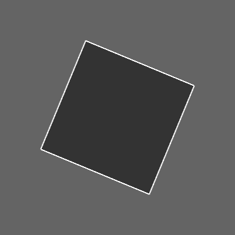
```
size(200, 200, P3D);
background(100);
rectMode(CENTER);
fill(51);
stroke(255);

translate(100, 100, 0);
rotateZ(PI/8);
rect(0, 0, 100, 100);

```

We can also rotate around the x and y axes.

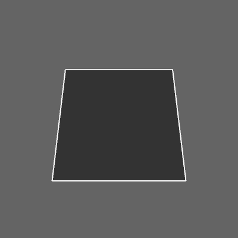
```
rotateX(PI/8);
```

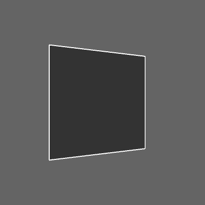
```
rotateY(PI/8);
```

As well as multiple axes at a time.

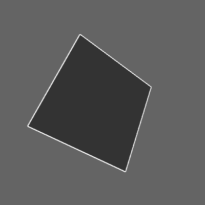
```
translate(100, 100, 0);
rotateX(PI/8);
rotateY(PI/8);
rotateZ(PI/8);
rect(0, 0, 100, 100);
```

## 3D Shapes

Once you know how to translate and rotate around a three-dimensional coordinate system, you are ready to draw some three-dimensional shapes.  You are probably quite comfortable with drawing shapes in 2D whether primitive ([line()](http://processing.org/reference/line_.html), [rect()](http://processing.org/reference/rect_.html), [ellipse()](http://processing.org/reference/ellipse_.html), [triangle()](http://processing.org/reference/triangle_.html), etc.) or custom ([beginShape()](http://processing.org/reference/beginShape_.html), [endShape()](http://processing.org/reference/endShape_.html), and [vertex()](http://processing.org/reference/vertex_.html)).
    
The good news is that shapes in 3D work pretty much the same way.  There are primitive shapes that you get for free such as [box()](http://processing.org/reference/box_.html) and [sphere()](http://processing.org/reference/sphere_.html) as well as custom shapes you can make with calls to vertex().

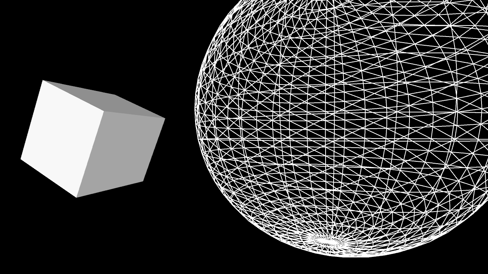
```
size(640,360,P3D);
background(0);
lights();

pushMatrix();
translate(130, height/2, 0);
rotateY(1.25);
rotateX(-0.4);
noStroke();
box(100);
popMatrix();

pushMatrix();
translate(500, height*0.35, -200);
noFill();
stroke(255);
sphere(280);
popMatrix();
```
See also: [Primitives3D](http://processing.org/learning/basics/primitives3d.html)

In the above example, note that the functions box() and sphere() each only take one argument: size. These 3D shapes cannot be positioned via arguments, rather you should use the translate() and rotate() methods described previously.
    
Custom 3D shapes are drawn using [beginShape()](http://processing.org/reference/beginShape_.html), [endShape()](http://processing.org/reference/endShape_.html), and [vertex()](http://processing.org/reference/vertex_.html) by placing multiple polygons side by side.  In 3D, the vertex() function takes 3 arguments: x, y, and z.  Let's say we want to draw a four-sided pyramid made up of four triangles, all connected to one point (the &ldquo;apex&rdquo;) and a flat plane (the &ldquo;base&rdquo;).
    
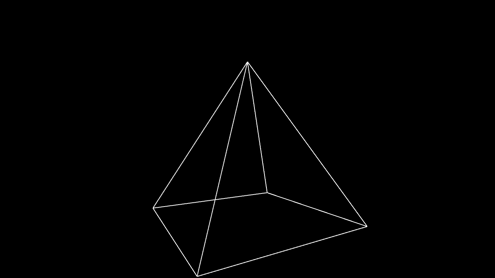
```
size(640, 360, P3D);
background(0);

translate(width/2, height/2, 0);
stroke(255);
rotateX(PI/2);
rotateZ(-PI/6);
noFill();

beginShape();
vertex(-100, -100, -100);
vertex( 100, -100, -100);
vertex(   0,    0,  100);

vertex( 100, -100, -100);
vertex( 100,  100, -100);
vertex(   0,    0,  100);

vertex( 100, 100, -100);
vertex(-100, 100, -100);
vertex(   0,   0,  100);

vertex(-100,  100, -100);
vertex(-100, -100, -100);
vertex(   0,    0,  100);
endShape();

```

Note above how it's often simpler to specify vertex locations using a standardized unit of measure (i.e. 1 pixel) and relative to a point of origin (0,0,0).   The size and position of the shape is then set using matrix transformations: translate(), rotate(), and scale().   For some examples of more sophisticated custom shapes built in 3D, take a look at these examples: [RGB Cube](http://processing.org/learning/topics/rgbcube.html), [Vertices](http://processing.org/learning/topics/vertices.html), [Toroid](http://processing.org/learning/topics/toroid.html), [Isocahedra](http://processing.org/learning/topics/icosahedra.html).

## Textures

With the P3D renderer, you can load and display images just like you do in 2D (see: [Images and Pixels Tutorial](http://processing.org/tutorials/pixels/)).  Everything covered under transformations can be applied to images; they can be translated, rotated, and scaled in a virtual 3D space.   In addition to drawing an image the old-fashioned way, however, images can be made into &ldquo;textures&rdquo; and applied to a shape.  This is particularly useful when you want a 3D shape to resemble a real-world object.  For example, applying an image of earth as a texture on a sphere will result in a globe.  To apply an image as a texture to a shape, we first need to define the shape using `beginShape()` and `endShape()` as demonstrated in the previous section.  Let's say you are drawing a rectangle, like so:

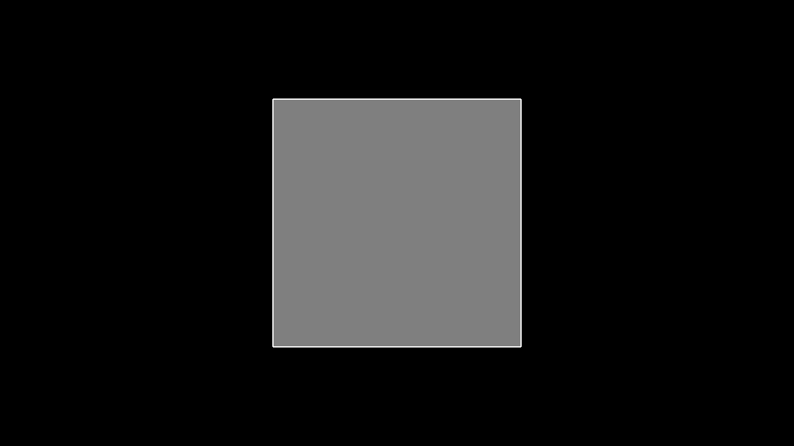
```
size(640, 360, P3D);
background(0);
translate(width/2, height/2);
stroke(255);
fill(127);
beginShape();
vertex(-100, -100, 0);
vertex( 100, -100, 0);
vertex( 100,  100, 0);
vertex(-100,  100, 0);
endShape(CLOSE);

```
 
The above example is a simple square with four vertices, a white outline, and a grey fill.  To apply an image to the shape, we have to follow three steps.  
1. Load an image into a PImage object.
```
PImage img;

void setup() {
  size(640, 360, P3D);
  img = loadImage("berlin-1.jpg");
}
```
2. Call [texture()](http://processing.org/reference/texture_.html).  The texture() function must be called between beginShape() and endShape() and before any calls to vertex().  The texture() function receives only one argument, the PImage that will be applied as a texture.
```
void draw() {
  background(0);  
  translate(width / 2, height / 2);
  stroke(255);
  fill(127);
  beginShape();
  texture(img);
}
```

Once we have specified the texture itself, we have to then define the mapping of the image to the shape itself.  This is a simple problem when the shape is rectangular (four corners of a shape map to four corners of an image), but grows more complex when you have many more vertices in a shape (such as in the globe example above).   To define the mapping, two more arguments (usually referred to as ***u*** and ***v*** are added to each call to vertex().  By default, the coordinates used for ***u*** and ***v*** are specified in relation to the image's size in pixels, but this relation can be changed with [textureMode()](http://processing.org/reference/textureMode_.html).     In addition, when textures are in use, the fill color is ignored. Instead, use [tint()](http://processing.org/reference/tint_.html) to specify the color of the texture as it is applied to the shape.
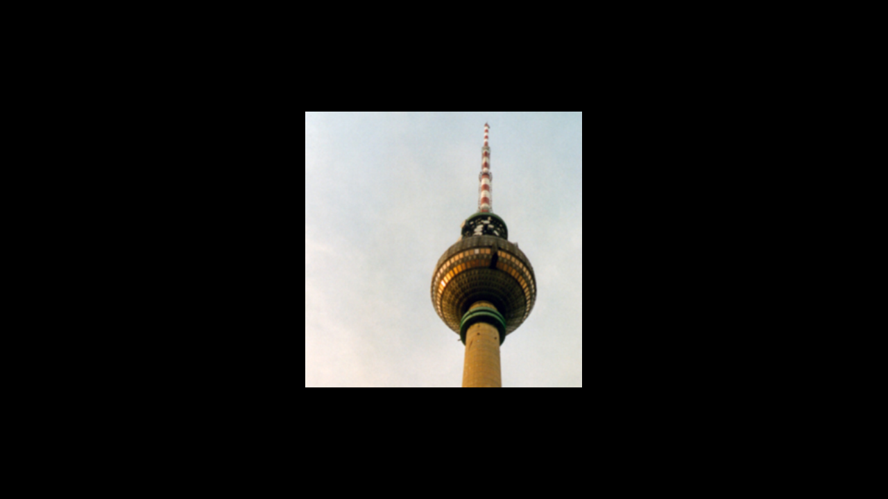
[Example: Texture Quad](http://processing.org/learning/topics/texturequad.html)
    
```
void draw() {
  background(0);
  translate(width / 2, height / 2);
  beginShape();
  texture(img);
  vertex(-100, -100, 0, 0,   0);
  vertex( 100, -100, 0, 400, 0);
  vertex( 100,  100, 0, 400, 400);
  vertex(-100,  100, 0, 0,   400);
  endShape();
}
```

If the above seems like a trivial example, that's because it is.  After all, if we're just going to texture a square, we can just draw the image using image().  Nevertheless, understanding the above process opens up a world of possibilities as we can now apply image textures to arbitrary 2D and 3D shapes.  For some examples of more sophisticated mappings, check out [Texture Triangle](http://processing.org/learning/topics/texturetriangle.html), [Texture Cylinder](http://processing.org/learning/topics/texturecylinder.html), [Texture Cube](http://processing.org/learning/topics/texturecube.html), and [Textured Sphere](https://processing.org/examples/texturesphere.html).

As mentioned in the ()PShape tutorial], you can also texture `PShape` objects with the `setTexture()` function.  PShape's `setTexture()` automatically textures the shape without having to specify uv coordinates and is useful for simple scenarios like texturing a sphere (where doing it with `beginShape()` and `endShape()` would be extraordinarily complex (as seen in [Textured Sphere](https://processing.org/examples/texturesphere.html)).  The following code demonstrates how easy it is to texture with `PShape`.

```
PImage img;
PShape globe;
    
void setup() {
  img = loadImage("earth.jpg");
  globe = createShape(SPHERE, 50);
  globe.setTexture(img);
}
```

## Lighting

In P3D, you can also manipulate the lighting of the elements in your scene.  Of course, just as drawing in three-dimensions is an illusion, the addition of lighting to a Processing sketch is a simulation of the idea of real world lighting for the purpose of creating a variety of effects.  This is particularly useful since some objects (such as a sphere) do not appear three-dimensional until they are lit.
    
If you don't want to get into the details of setting custom lighting for a 3D scene you can use Processing's [lights()](http://processing.org/reference/lights_.html) function which sets default lighting.  Take a look at the following example, where a sphere is lit with default lighting only when the mouse is pressed.
    
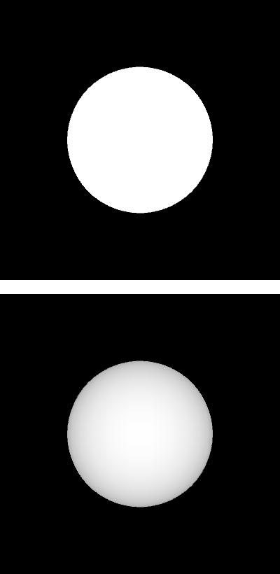
```
void setup() {
  size(200, 200, P3D);
}

void draw() {
  background(0);
  translate(100, 100, 0);
  if (mousePressed) {
    lights();
  }
  noStroke();
  fill(255);
  sphere(50);
}
```
Note how the call to the lights() function is included in draw().  Just as with matrix transformations, the 3D scene is reset each time through draw() and therefore any lighting must be included in order to remain persistent.

In order to set custom lighting for your scene there are four different kinds of lights.
- [ambientLight()](http://processing.org/reference/ambientLight_.html) -- Ambient light doesn't come from a specific direction, the rays of light have bounced around so much that objects are evenly lit from all sides. Ambient lights are almost always used in combination with other types of lights.  An ambient light is specified with an RGB color and, optionally, an xyz location for the light. For example, a blue ambient light can be added to a scene as follows:

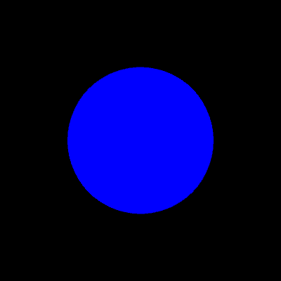

```
ambientLight(0,0,255);
```
- [directionalLight()](http://processing.org/reference/directionalLight_.html) --Directional light comes from one direction and is stronger when hitting a surface squarely and weaker if it hits at a gentle angle. After hitting a surface, a directional lights scatters in all directions.  A directional light is specified with an RGB color and an xyz vector that defines a direction for the light.  For example, a green light that comes from below the scene can be added to a scene as follows:
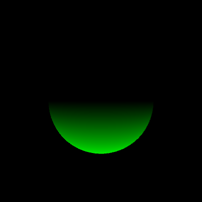
```
directionalLight(0, 255, 0, 0, -1, 0);
```
- [spotLight()](http://processing.org/reference/spotLight_.html) -- A spotlight is similar to a directional light, but allows you to control the lighting effect with greater specificity.  Just as before, the light is defined with a color and direction.  However, it also requires an xyz location for the light as well as an angle that controls the spotlight cone.  A small angle value will result in a highly focused light and a larger angle will result more of a wash of light.  Finally, a last argument determines the concentration of the light, how biased is the light towards the center of the spotlight cone.   Here are the arguments you'll need for a concentrated red light, located in front of the Processing window and pointing straight back.
    - The red color: ***255, 0, 0***
    - Located in front of a Processing window: ***width/2, height/2, 400***
    - Pointing straight back: ***0, 0, -1***
    - A small angle: ***PI/4***
    - Concentration: ***2***
    
All together it looks like:

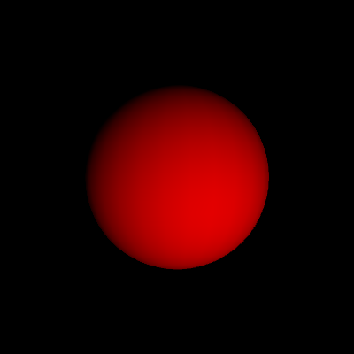
    
```
spotLight(255, 0, 0, width/2, height/2, 400, 0, 0, -1, PI/4, 2);
```
- [pointLight()](http://processing.org/reference/pointLight_.html) -- A point light is a spotlight with a 180 degree cone.  To create a point light, you only need an RGB color and a position.
```
pointLight(255, 0, 0, width/2, height/2, 400);
```

For additional examples of lighting in Processing, take a look at: [Lights on off](http://processing.org/examples/onoff.html), [Spot](http://processing.org/examples/spot.html), [Directional](http://processing.org/examples/directional.html), [Reflection](http://processing.org/examples/reflection.html).
    
## Perspective

P3D mode consists of two different &ldquo;projection&rdquo; modes which control the way the renderer creates the 3D illusion.  &ldquo;Perspective&rdquo; mode is the default and uses the trick of displaying objects that are farther away as smaller.  This effect is commonly referred to as &ldquo;foreshortening.&rdquo;  In most cases, you don't need to specify the parameters of perspective projection, but you can with the [perspective()](http://processing.org/reference/perspective_.html) function.  The parameters of the function define a viewing volume with the shape of truncated pyramid. Objects near to the front of the volume appear their actual size, while farther objects appear smaller.   The triangle has a field of view (angle in radians), an aspect ratio, and a maximum and minimum z location that defines the clipping plane (how far and how close Processing will actually bother to try to render things).   An example (that recreates the default perspective) looks like so:

```
float fov = PI/3;
float cameraZ = (height/2.0) / tan(fov/2.0);
perspective(fov, float(width)/float(height), cameraZ/10.0, cameraZ*10.0);   
```

It's not too often you'll need to change these parameters, but if you do, altering the field of view (&ldquo;fov&rdquo;) tends to have the effect of zooming objects in and out (as the viewing volume grows and shrinks) and changing the aspect ratio can skew the rendering of objects making the appear fatter or skinnier.  For an example of this, take a look at: [Perspective](http://processing.org/examples/perspective.html).      
    
The other projection mode available in P3D is known as &ldquo;orthographic&rdquo; projection.  In orthographic mode, all objects with the same dimension appear the same size, regardless of whether they are near or far from the camera.   This is commonly used to achieve a certain visual style, such as one found in early video games like Q-Bert.  To enable orthographic projection, all you need to do is call [ortho()](http://processing.org/reference/ortho_.html)  ortho() doesn't require any arguments, although you'll see there are some optional ones to define a clipping plane.  Following is an example that shows a scene in both projection modes, depending on whether the mouse is pressed.

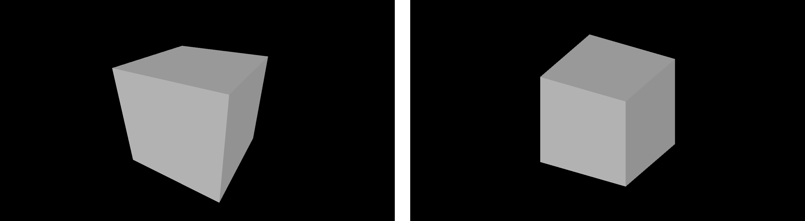
(left image is perspective and right image is orthographic)

```
void setup()  {
  size(640, 360, P3D);
  noStroke();
  fill(204);
}

void draw()  {
  background(0);
  lights();

  if(mousePressed) {
    float fov = PI/3.0; 
    float cameraZ = (height/2.0) / tan(fov/2.0); 
    perspective(fov, float(width)/float(height), cameraZ/2.0, cameraZ*2.0); 
  } else {
    ortho(-width/2, width/2, -height/2, height/2);
  }
  translate(width/2, height/2, 0);
  rotateX(-PI/6); 
  rotateY(PI/3); 
  box(160); 
}
```

## Camera

When looking at a 3D scene in a Processing window, we can think of our view of the scene as a camera.  Zoom in closer to the objects and we can imagine a camera zooming in.  Rotate around the scene and the camera rotates.  Of course, there is no actual camera, this is just a convenient device to help us understand how to traverse a 3D scene.  Simulating a camera can be done through clever transformations at the beginning of draw() by using translate(), rotate(), and scale() to manipulate our view of the scene.  Nevertheless, for convenience there is also a [camera()](http://processing.org/reference/camera_.html) function whose purpose is also to simulate a camera.  The function defines a camera as having an &ldquo;eye position&rdquo;, i.e. the camera location, a scene &ldquo;center&rdquo; which tells the camera which way to point, and an upward axis which aligns the camera vertically.The default camera position is essentially right between your eyes: a location out in front of the window aligned straight up and pointing towards the screen.  Here are the numbers for the default position.
- Eye position: ***width/2, height/2, (height/2) / tan(PI/6)***
- Scene center: ***width/2, height/2, 0***
- Upwards axis: ***0, 1, 0***
    
When written in code, this looks like:
```
camera(width/2, height/2, (height/2) / tan(PI/6), width/2, height/2, 0, 0, 1, 0);
```
Any of the arguments in the camera() function can be made into a variable to simulate camera movements. For example, by moving the x position of the eye according to the mouse, you can rotate around an object to see it from a different angle.  
    

```
void setup() {
  size(640, 360, P3D);
}

void draw() {
  background(0);
  camera(mouseX, height/2, (height/2) / tan(PI/6), width/2, height/2, 0, 0, 1, 0);
  translate(width/2, height/2, -100);
  stroke(255);
  noFill();
  box(200);
}
```

If you move both the eye position and the scene's center according to the mouse, you can create the effect of panning.

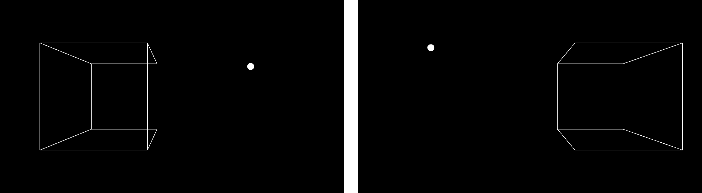
```
void setup() {
  size(640, 360, P3D);
}

void draw() {
  background(0);
  camera(mouseX>, height/2, (height/2) / tan(PI/6), mouseX, height/2, 0, 0, 1, 0);
  translate(width/2, height/2, -100);
  stroke(255);
  noFill();
  box(200);
}
```
