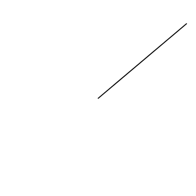
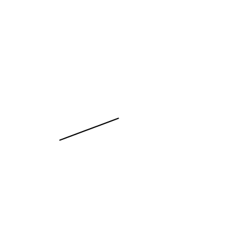
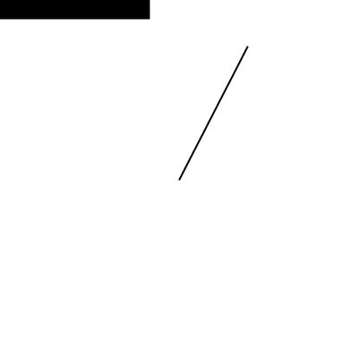
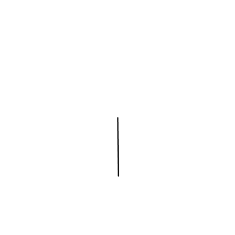
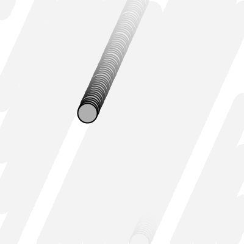
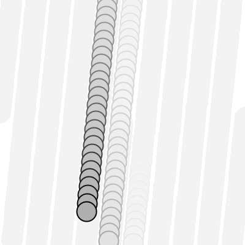
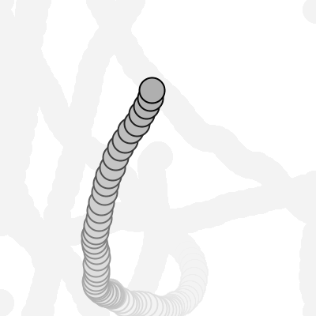
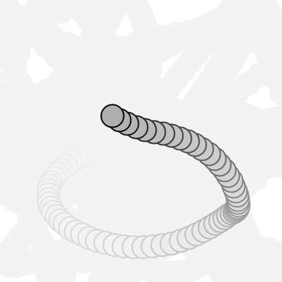
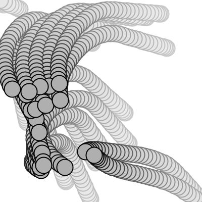

<Note>

This tutorial is adapted from [The Nature of Code](http://natureofcode.com) by Daniel Shiffman. This work is licensed under a [Creative Commons Attribution-NonCommercial 3.0 Unported License](http://creativecommons.org/licenses/by-nc/3.0/). If you see any errors or have comments, please [let us know](https://github.com/processing/processing-website/issues?q=is%3Aopen).

</Note>

The most basic building block for programming motion is the **_vector_**. And so this is where we begin. Now, the word **_vector_** can mean a lot of different things. Vector is the name of a new wave rock band formed in Sacramento, CA in the early 1980s. It's the name of a breakfast cereal manufactured by Kellogg's Canada. In the field of epidemiology, a vector is used to describe an organism that transmits infection from one host to another. In the C++ programming language, a Vector (std::vector) is an implementation of a dynamically resizable array data structure. While all interesting, these are not the definitions we are looking for. Rather, what we want is this **_vector_**:

**_A vector is a collection of values that describe relative position in space._**

<FixedImage width={650} height={300}>


</FixedImage>

## Vectors: You Complete Me

Before we get into vectors themselves, let's look at a beginner Processing example that demonstrates why it is in the first place we should care. If you've read any of the introductory Processing textbooks or taken a class on programming with Processing (and hopefully you've done one of these things to help prepare you for this book), you probably, at one point or another, learned how to write a simple bouncing ball sketch.

Example: Bouncing Ball with No Vectors

<FixedImage side width={200} height={200}>


</FixedImage>

```

float x = 100;
float y = 100;
float xspeed = 1;
float yspeed = 3.3;

void setup() {
  size(200,200);
  smooth();
  background(255);
}

void draw() {
  noStroke();
  fill(255,10);
  rect(0,0,width,height);

  // Add the current speed to the location.
  x = x + xspeed;
  y = y + yspeed;

  // Check for bouncing
  if ((x > width) || (x < 0)) {
    xspeed = xspeed * -1;
  }
  if ((y > height) || (y < 0)) {
    yspeed = yspeed * -1;
  }

  // Display at x,y location
  stroke(0);
  fill(175);
  ellipse(x,y,16,16);
}
```

In the above example, we have a very simple world -- a blank canvas with a circular shape (&ldquo;ball&rdquo;) traveling around. This &ldquo;ball&rdquo; has some properties.

- LOCATION: x and y
- SPEED: xspeed and yspeed
  In a more advanced sketch, we could imagine this ball and world having many more properties:
- ACCELERATION: xacceleration and yacceleration
- TARGET LOCATION: xtarget and ytarget
- WIND: xwind and ywind
- FRICTION: xfriction and yfriction

It's becoming more and more clear that for every singular concept in this world (wind, location, acceleration, etc.), we need two variables. And this is only a two-dimensional world, in a 3D world, we'd need x, y, z, xspeed, yspeed, zspeed, etc. Our first goal in this chapter is learn the fundamental concepts behind using vectors and rewrite this bouncing ball example. After all, wouldn't it be nice if we could simple write our code like the following?

Instead of:

```

float x;
float y;
float xspeed;
float yspeed;
```

Woudn't it be nice to have. . .

```
Vector location;
Vector speed;
```

Vectors aren't going to allow us to do anything new. Using vectors won't suddenly make your Processing sketches magically simulate physics, however, they will simplify your code and provide a set of functions for common mathematical operations that happen over and over and over again while programming motion.

As an introduction to vectors, we're going to live in 2 dimensions for quite some time (at least until we get through the first several chapters.) All of these examples can be fairly easily extended to three dimensions (and the class we will use -- [**PVector**](http://processing.org/reference/PVector.html) -- allows for three dimensions.) However, for the time being, it's easier to start with just two.

## Vectors: What are they to us, the Processing programmer?

Technically speaking, the definition of a vector is the difference between two points. Consider how you might go about providing instructions to walk from one point to another.

Here are some vectors and possible translations:

<FixedImage width={650} height={700}>


</FixedImage>

You've probably done this before when programming motion. For every frame of animation (i.e. single cycle through Processing's (http://processing.org/reference/draw_.html)draw()] loop), you instruct each object on the screen to move a certain number of pixels horizontally and a certain number of pixels (vertically).

For a Processing programmer, we can now understand a vector as the instructions for moving a shape from point A to point B, an object's &ldquo;pixel velocity&rdquo; so to speak.

For every frame:

**_location = location + velocity_**

<FixedImage width={650} height={250}>


</FixedImage>

If velocity is a vector (the difference between two points), what is location? Is it a vector too? Technically, one might argue that location is not a vector, it's not describing the change between two points, it's simply describing a singular point in space -- a location. And so conceptually, we think of a location as different: a single point rather than the difference between two points.

Nevertheless, another way to describe a location is as the path taken from the origin to reach that location. Hence, a location can be represented as the vector giving the difference between location and origin. Therefore, if we were to write code to describe a vector object, instead of creating separate Point and Vector classes, we can use a single class which is more convenient.

Let's examine the underlying data for both location and velocity. In the bouncing ball example we had the following:

```
location --> x,y
velocity --> xspeed,yspeed
```

Notice how we are storing the same data for both -- two floating point numbers, an x and a y. If we were to write a vector class ourselves, we'd start with something rather basic:

```
class PVector {

  float x;
  float y;

  PVector(float x_, float y_) {
    x = x_;
    y = y_;
  }

}
```

At its core, a [**PVector**](http://processing.org/reference/PVector.html) is just a convenient way to store two values (or three, as we'll see in 3D examples.).

And so this. . .

```
float x = 100;
float y = 100;
float xspeed = 1;
float yspeed = 3.3;
```

. . . becomes . . .

```
PVector location = new PVector(100,100);
PVector velocity = new PVector(1,3.3);
```

Now that we have two vector objects (&ldquo;location&rdquo; and &ldquo;velocity&rdquo;), we're ready to implement the algorithm for motion -- location = location + velocity. In the bouncing ball example, without vectors, we had:

```
  // Add the current speed to the location.
  x = x + xspeed;
  y = y + yspeed;
```

In an ideal world, we would just be able to rewrite the above to be:

```
// Add the current velocity vector to the location vector.
  location = location + velocity;
```

However, in Processing, the addition operator '+' is reserved for primitive values (integers, floats, etc.) only. Processing doesn't know how to add two **PVector**](http://processing.org/reference/PVector.html) objects together any more than it knows how to add two PFont objects or PImage objects. Fortunately for us, the [**PVector**](http://processing.org/reference/PVector.html) class is implemented with functions for common mathematical operations.

## Vectors: Addition

Before we continue looking at the [**PVector**](http://processing.org/reference/PVector.html) class and its [**_add()_**](http://processing.org/reference/PVector_add_.html) method (purely for the sake of learning since it's already implemented for us in Processing itself), let's examine vector addition using the notation found in math/physics textbooks.

Vectors are typically written as with either boldface type or with an arrow on top. For the purposes of this tutorial, to distinguish a **vector** from a **scalar** (scalar refers to a single value, such as integer or floating point), we'll use boldface type:

Vector: **v**
Scalar: x

Let's say I have the following two vectors:

<FixedImage width={650} height={150}>


</FixedImage>

**u** = (5,2)
**v** = (3,4)

Each vector has two components, an x and a y. To add two vectors together we simply add both x's and both y's. In other words:

**w** = **u** + **v**

translates to:

**w**<sub>x</sub> = **u**<sub>x</sub> + **v**<sub>x</sub>
**w**<sub>y</sub> = **u**<sub>y</sub> + **v**<sub>y</sub>

and therefore:

**w**<sub>x</sub> = 5 + 3
**w**<sub>y</sub> = 2 + 4

and therefore:

**w** = (8,6)

<FixedImage width={650} height={230}>


</FixedImage>

Now that we understand how to add two vectors together, we can look at how addition is implemented in the [**PVector**](http://processing.org/reference/PVector.html) class itself. Let's write a function called [**_add()_**](http://processing.org/reference/PVector_add_.html) that takes as its argument another PVector object.

```
class PVector {

  float x;
  float y;

  PVector(float x_, float y_) {
    x = x_;
    y = y_;
  }

  // New!  A function to add another PVector to this PVector.
  // Simply add the x components and the y components together.
  void add(PVector v) {
    x = x + v.x;
    y = y + v.y;
  }
}
```

Now that we see how add is written inside of [**PVector**](http://processing.org/reference/PVector.html), we can return to the location + velocity algorithm with our bouncing ball example and implement vector addition:

```
  // Add the current velocity to the location.
  <del>location = location + velocity;</del>
  location.add(velocity);
```

And here we are, ready to successfully complete our first goal -- rewrite the entire bouncing ball example using [**PVector**](http://processing.org/reference/PVector.html).

Example: Bouncing Ball with PVector!

```
// Instead of a bunch of floats, we now just have two PVector variables.
PVector location;
PVector velocity;

void setup() {
  size(200,200);
  smooth();
  background(255);
  location = new PVector(100,100);
  velocity = new PVector(2.5,5);
}

void draw() {
  noStroke();
  fill(255,10);
  rect(0,0,width,height);

  // Add the current speed to the location.
  location.add(velocity);

  // We still sometimes need to refer to the individual components of a PVector
  // and can do so using the dot syntax (location.x, velocity.y, etc.)
  if ((location.x > width) || (location.x < 0)) {
    velocity.x = velocity.x * -1;
  }
  if ((location.y > height) || (location.y < 0)) {
    velocity.y = velocity.y * -1;
  }

  // Display circle at x location
  stroke(0);
  fill(175);
  ellipse(location.x,location.y,16,16);
}
```

Now, you might feel somewhat disappointed. After all, this may initially appear to have made the code more complicated than the original version. While this is a perfectly reasonable and valid critique, it's important to understand that we haven't fully realized the power of programming with vectors just yet. Looking at a simple bouncing ball and only implementing vector addition is just the first step. As we move forward into looking at more a complex world of multiple objects and multiple forces (we'll cover forces in the next chapter), the benefits of [**PVector**](http://processing.org/reference/PVector.html) will become more apparent.

We should, however, make note of an important aspect of the above transition to programming with vectors. Even though we are using [**PVector**](http://processing.org/reference/PVector.html) objects to describe two values -- the x and y of location and the x and y of velocity -- we still often need to refer to the x and y components of each [**PVector**](http://processing.org/reference/PVector.html) individually. When we go to draw an object in Processing there's no means for us to say:

```
ellipse(location,16,16);
```

The [**_ellipse()_**](http://processing.org/reference/ellipse_.html) function does not allow for a [**PVector**](http://processing.org/reference/PVector.html) as an argument. An ellipse can only be drawn with two scalar values, an x coordinate and a y coordinate. And so we must dig into the [**PVector**](http://processing.org/reference/PVector.html) object and pull out the x and y components using object oriented dot syntax.

```
ellipse(location.x,location.y,16,16);
```

The same issue arises when it comes time to test if the circle has reached the edge of the window, and we need to access the individual components of _both_ vectors: location and velocity.

```
if ((location.x > width) || (location.x < 0)) {
  velocity.x = velocity.x * -1;
}
```

## Vectors: More Algebra

Addition was really just the first step. There is a long list of common mathematical operations that are used with vectors when programming the motion of objects on the screen. Following is a comprehensive list of all of the mathematical operations available as functions in the [**PVector**](http://processing.org/reference/PVector.html) class. We'll then go through a few of the key ones now. As our examples get more and more sophisticated we'll continue to reveal the details of these functions.

- [**_add()_**](http://processing.org/reference/PVector_add_.html) &mdash; add vectors
- [**_sub()_**](http://processing.org/reference/PVector_sub_.html) &mdash; subtract vectors
- [**_mult()_**](http://processing.org/reference/PVector_mult_.html) &mdash; scale the vector with multiplication
- [**_div()_**](http://processing.org/reference/PVector_div_.html) &mdash; scale the vector with division
- [**_mag()_**](http://processing.org/reference/PVector_mag_.html) &mdash; calculate the magnitude of a vector
- [**_normalize()_**](http://processing.org/reference/PVector_normalize_.html) &mdash; normalize the vector to unit length of 1
- [**_limit()_**](http://processing.org/reference/PVector_limit_.html) &mdash; limit the magnitude of a vector
- [**_heading()_**](http://processing.org/reference/PVector_heading_.html) &mdash; the heading of a vector expressed as an angle
- [**_dist()_**](http://processing.org/reference/PVector_dist_.html) &mdash; the euclidean distance between two vectors (considered as points)
- [**_angleBetween()_**](http://processing.org/reference/PVector_angleBetween_.html) &mdash; find the angle between two vectors
- [**_dot()_**](http://processing.org/reference/PVector_dot_.html) &mdash; the dot product of two vectors
- [**_cross()_**](http://processing.org/reference/PVector_cross_.html) &mdash; the cross product of two vectors

Having already run through addition, let's start with subtraction. This one's not so bad, just take the plus sign from addition and replace it with a minus!

Vector subtraction: **w** = **u** - **v**

translates to:

**w**<sub>x</sub> = **u**<sub>x</sub> - **v**<sub>x</sub>
**w**<sub>y</sub> = **u**<sub>y</sub> - **v**<sub>y</sub>

and the function inside [**PVector**](http://processing.org/reference/PVector.html) therefore looks like:

```
  void sub(PVector v) {
    x = x - v.x;
    y = y - v.y;
  }
```

<FixedImage width={650} height={230}>


</FixedImage>

Following is an example that demonstrates vector subtraction by taking the difference between two points -- the mouse location and the center of the window.

Example: Vector subtraction

<FixedImage side width={200} height={200}>



</FixedImage>

```
void setup() {
  size(200,200);
  smooth();
}

void draw() {
  background(255);

  // Two PVectors, one for the mouse location and one for the center of the window.
  PVector mouse = new PVector(mouseX,mouseY);
  PVector center = new PVector(width/2,height/2);

  // PVector subtraction!
  mouse.sub(center);

  // Draw a line to represent the vector.
  translate(width/2,height/2);
  line(0,0,mouse.x,mouse.y);

}
```

<HighlightBlock>

Both addition and subtraction with vectors follows the same algebraic rules as with real numbers.

The commutative rule: **u** + **v** = **v** + **u**

The associative rule: **u** + (**v** + **w**) = (**u** + **v**) + **w**

The fancy terminology and symbols aside, this is really quite a simple concept. We're just saying that common sense properties of addition apply with vectors as well.

3 + 2 = 2 + 3

(3 + 2) + 1 = 3 + (2 + 1)

</HighlightBlock>

Moving onto multiplication, we have to think a little bit differently. When we talk about multiplying a vector what we usually mean is **_scaling_** a vector. Maybe we want a vector to be twice its size or one-third its size, etc. In this case, we are saying &ldquo;Multiply a vector by 2&rdquo; or &ldquo;Multiply a vector by 1/3&rquo;. Note we are multiplying a vector by a scalar, a single number, not another vector.

To scale a vector by a single number, we multiply each component (x and y) by that number.

Vector multiplication:

**w** = **v** \* n

translates to:

**w**<sub>x</sub> = **v**<sub>x</sub> _ n
**w**<sub>y</sub> = **v**<sub>y</sub> _ n

Let's look at an example with vector notation.

**u** = (-3,7)
n = 3

**w** = **u** _ n
**w**<sub>x</sub> = -3 _ 3
**w**<sub>y</sub> = 7 \* 3

**w** = (-9, 21)

<FixedImage width={650} height={500}>


</FixedImage>

The function inside the PVector class therefore is written as:

```
 void mult(float n) {
   // With multiplication, all components of the vector are multiplied by a number.
   x = x * n;
   y = y * n;
 }
```

And implementing multiplication in code is as simple as:

```
PVector u = new PVector(-3,7);
u.mult(3); // This PVector is now three times the size and is equal to (-9,21).
```

Example: Vector multiplication

<FixedImage side width={200} height={200}>



</FixedImage>

```
void setup() {
  size(200,200);
  smooth();
}

void draw() {
  background(255);

  PVector mouse = new PVector(mouseX,mouseY);
  PVector center = new PVector(width/2,height/2);
  mouse.sub(center);

  // PVector multiplication!
  // The vector is now half its original size (multiplied by 0.5).
  mouse.mult(0.5);

  translate(width/2,height/2);
  line(0,0,mouse.x,mouse.y);

}
```

Division is exactly the same as multiplication, only of course using divide instead of multiply.

<FixedImage width={650} height={170}>


</FixedImage>

```
  void div(float n) {
    x = x / n;
    y = y / n;
  }

PVector u = new PVector(8,-4);
u.div(2);
```

<HighlightBlock>

As with addition, basic algebraic rules of multiplication and division apply to vectors.

The associative rule: (n\*m)**\*v** = n\*(m**\*v**)
The distributive rule, 2 scalars, 1 vector: (n + m)**\*v** = n**\*v** + m**\*v**
The distributive rule, 2 vectors, 1 scalar : (**u** +**v**)\*n = n**\*u** + n**\*v**

</HighlightBlock>

## Vectors: Magnitude

Multiplication and division, as we just saw, is a means by which the length of the vector can be changed without affecting direction. And so, perhaps you're wondering: &ldquo;Ok, so how do I know what the length of a vector is?&rdquo; I know the components (x and y), but I don't know how long (in pixels) that actual arrow is itself?!

<FixedImage width={650} height={170}>


</FixedImage>

The length or &ldquo;magnitude&rdquo; of a vector is often written as: ||**v**||

Understanding how to calculate the length (referred from here on out as magnitude) is incredibly useful and important.

Notice in the above diagram how when we draw a vector as an arrow and two components (x and y), we end up with a right triangle. The sides are the components and the hypotenuse is the arrow itself. We're very lucky to have this right triangle, because once upon a time, a Greek mathematician named Pythagoras developed a nice formula to describe the relationship between the sides and hypotenuse of a right triangle.

<FixedImage width={650} height={170}>


</FixedImage>

The Pythagorean theorem: a squared plus b squared equals c squared.

Armed with this lovely formula, we can now compute the magnitude of as follows:

**||**v**|| = sqrt(**v**<sub>x</sub>\***v**<sub>x</sub> + **v**<sub>y</sub>\***v**<sub>y</sub>)**

or in [**PVector**](http://processing.org/reference/PVector.html):

```
float mag() {
  return sqrt(x*x + y*y);
}
```

Example: Vector magnitude

<FixedImage side width={200} height={200}>



</FixedImage>

```
void setup() {
  size(200,200);
  smooth();
}

void draw() {
  background(255);

  PVector mouse = new PVector(mouseX,mouseY);
  PVector center = new PVector(width/2,height/2);
  mouse.sub(center);

  // The magnitude (i.e. length) of a vector can be accessed via the (http://processing.org/reference/PVector_mag_.html)mag()] function.
  // Here it is used as the width to a rectangle drawn at the top of the window.
  float m = mouse.mag();
  fill(0);
  rect(0,0,m,10);

  translate(width/2,height/2);
  line(0,0,mouse.x,mouse.y);

}
```

## Vectors: Normalizing

Calculating the magnitude of a vector is only the beginning. The magnitude function opens the door to many possibilities, the first of which is **_normalization_**. Normalizing refers to the process of making something &ldquo;standard&rdquo; or, well, &ldquo;normal.&rdquo; In the case of vectors, let's assume for the moment that a standard vector has a length of one. To normalize a vector, therefore, is to take a vector of any length and, keeping it pointing in the same direction, change its length to one, turning it into what is referred to as a **_unit vector_**.

<FixedImage width={650} height={250}>


</FixedImage>

Being able to quickly access the unit vector is useful since it describes a vector's direction without regard to length. For any given vector **u**, its unit vector (written as &#251;) is calculated as follows:

&#251; = **u** / ||**u**||

In other words, to normalize a vector, simply divide each component by its magnitude. This makes pretty intuitive sense. Say a vector is of length 5. Well, 5 divided by 5 is 1. So looking at our right triangle, we then need to scale the hypotenuse down by dividing by 5. And so in that process the sides shrink, dividing by 5 as well.

<FixedImage width={650} height={160}>


</FixedImage>

In the (http://processing.org/reference/PVector.html)[**PVector**] class, we therefore write our normalization function as follows:

```
  void normalize() {
    float m = mag();
    div(m);
  }
```

Of course, there's one small issue. What if the magnitude of the vector is zero? We can't divide by zero! Some quick error checking will fix that right up:

```
  void normalize() {
   float m = mag();
   if (m != 0) {
     div(m);
   }
 }
```

Example: Normalizing a Vector

<FixedImage side width={200} height={200}>



</FixedImage>

```
void setup() {
  size(200,200);
  smooth();
}

void draw() {
  background(255);

  PVector mouse = new PVector(mouseX,mouseY);
  PVector center = new PVector(width/2,height/2);
  mouse.sub(center);

  // In this example, after the vector is normalized it is
  // multiplied by 50 so that it is viewable onscreen.
  // Note that no matter where the mouse is, the vector will
  // have same length (50), due to the normalization process.
  mouse.normalize();
  mouse.mult(50);

  translate(width/2,height/2);
  line(0,0,mouse.x,mouse.y);

}
```

## Vectors: Motion

Why should we care? Yes, all this vector math stuff sounds like something we should know about, but why exactly? How will it actually help me write code? The truth of the matter is that we need to have some patience. The awesomeness of using the PVector class will take some time to fully come to light. This is quite common actually when first learning a new data structure. For example, when you first learn about an array, it might have seemed like much more work to use an array than to just have several variables to talk about multiple things. But that quickly breaks down when you need a hundred, or a thousand, or ten thousand things. The same can be true for PVector. What might seem like more work now will pay off later, and pay off quite nicely.

For now, however, we want to focus on simplicity. What does it mean to program motion using vectors? We've seen the beginning of this in this book's first example: the bouncing ball. An object on screen has a location (where it is at any given moment) as well as a velocity (instructions for how it should move from one moment to the next). Velocity gets added to location:

```
location.add(velocity);
```

And then we draw the object at that location:

```
ellipse(location.x,location.y,16,16);
```

This is Motion 101.

- Add velocity to location
- Draw object at location
  In the bouncing ball example, all of this code happened in Processing's main tab, within [**_setup()_**](http://processing.org/reference/setup_.html) and [**_draw()_**](http://processing.org/reference/draw_.html). What we want to do now is move towards encapsulating all of the logic for motion inside of a [**_class_**](http://processing.org/reference/class.html), this way we can create a foundation for programming moving objects in Processing. We'll take a quick moment to review the basics of object-oriented programming in this context now, but this book will otherwise assume knowledge of working with objects (which will be necessary for just about every example from this point forward). However, if you need a further refresher, I encourage you to check out the [OOP tutorial](http://processing.org/tutorials/objects/).

The driving principle behind object-oriented programming is the bringing together of data and functionality. Take the prototypical OOP example: a car. A car has data -- color, size, speed, etc. A car has functionality -- drive(), turn(), stop(), etc. A car [**_class_**](http://processing.org/reference/class.html) brings all that stuff together in a template from which car instances, i.e. [**_objects_**](http://processing.org/reference/Object.html), are made. The benefit is nicely organized code that makes sense when you read it.

```
Car c = new Car(red,big,fast);
c.drive();
c.turn();
c.stop();
```

In our case, we're going to create a generic &ldquo;Mover&rdquo; class, a class to describe a shape moving about the screen. And so we must consider the following two questions:

1. What data does a Mover have?
2. What functionality does a Mover have?

Our &ldquo;Motion 101&rdquo; algorithm tells us the answers to these questions. The data an object has is its location and its velocity, two PVector objects.

```
class Mover {

  PVector location;
  PVector velocity;
```

Its functionality is just about as simple. It needs to move and it needs to be seen. We'll implement these as functions named update() and display(). update() is where we'll put all of our motion logic code and display() is where we will draw the object.

```
  void update() {
    location.add(velocity);
  }

  void display() {
    stroke(0);
    fill(175);
    ellipse(location.x,location.y,16,16);
  }

}
```

We've forgotten one crucial item, however, the object's **constructor**. The constructor is a special function inside of a class that creates the instance of the object itself. It is where you give the instructions on how to set up the object. It always has the same name as the class and is called by invoking the **new** operator: &ldquo;Car myCar = new Car(); &rdquo;.

In our case, let's just initialize our mover object by giving it a random location and a random velocity.

```
  Mover() {
    location = new PVector(random(width),random(height));
    velocity = new PVector(random(-2,2),random(-2,2));
  }
```

Let's finish off the Mover class by incorporating a function to determine what the object should do when it reaches the edge of the window. For now let's do something simple, and just have it wrap around the edges.

```
  void checkEdges() {

    if (location.x > width) {
      location.x = 0;
    } else if (location.x < 0) {
      location.x = width;
    }

    if (location.y > height) {
      location.y = 0;
    } else if (location.y < 0) {
      location.y = height;
    }

  }
```

Now that the Mover class is finished, we can then look at what we need to do in our main program. We first declare a Mover object:

```
Mover mover;
```

Then initialize the mover in setup():

```
  mover = new Mover();
```

and call the appropriate functions in draw():

```
  mover.update();
  mover.checkEdges();
  mover.display();
```

Here is the entire example for reference:

Example: Motion 101 (velocity)

<FixedImage side width={200} height={200}>



</FixedImage>

```
// Declare Mover object
Mover mover;

void setup() {
  size(200,200);
  smooth();
  background(255);
  // Make Mover object
  mover = new Mover();
}

void draw() {
  noStroke();
  fill(255,10);
  rect(0,0,width,height);

  // Call functions on Mover object.
  mover.update();
  mover.checkEdges();
  mover.display();
}

class Mover {

  // Our object has two PVectors: location and velocity
  PVector location;
  PVector velocity;

  Mover() {
    location = new PVector(random(width),random(height));
    velocity = new PVector(random(-2,2),random(-2,2));
  }

  void update() {
    // Motion 101: Locations changes by velocity.
    location.add(velocity);
  }

  void display() {
    stroke(0);
    fill(175);
    ellipse(location.x,location.y,16,16);
  }

  void checkEdges() {

    if (location.x > width) {
      location.x = 0;
    } else if (location.x < 0) {
      location.x = width;
    }

    if (location.y > height) {
      location.y = 0;
    } else if (location.y < 0) {
      location.y = height;
    }

  }

}
```

Ok, at this point, we should feel comfortable with two things -- (1) What is a [**PVector**](http://processing.org/reference/PVector.html)? and (2) How do we use PVectors inside of an object to keep track of its location and movement? This is an excellent first step and deserves an mild round of applause. For standing ovations and screaming fans, however, we need to make one more, somewhat larger, step forward. After all, watching the Motion 101 example is fairly boring -- the circle never speeds up, never slows down, and never turns. For more interesting motion, for motion that appears in the real world around us, we need to add one more PVector to our class -- acceleration.

The strict definition of acceleration that we are using here is: **the rate of change of velocity**. Let's think about that definition for a moment. Is this a new concept? Not really. Velocity is defined as: **the rate of change of location**. In essence, we are developing a &ldquo;trickle down&rdquo; effect. Acceleration affects velocity which in turn affects location (for some brief foreshadowing, this point will become even more crucial in the next chapter when we see how forces affect acceleration which affects velocity which affects location.) In code, this reads like this:

```
  velocity.add(acceleration);
  location.add(velocity);
```

As an exercise, from this point forward, let's make a rule for ourselves. Let's write every example in the rest of this book without ever touching the value of velocity and location (except to initialize them). In other words, our goal now for programming motion is as follows -- come up with an algorithm for how we calculate acceleration and let the trickle down effect work its magic. And so we need to come up with some ways to calculate acceleration:

ACCELERATION ALGORITHMS!

1. Make up a constant acceleration
2. A totally random acceleration
3. Perlin noise acceleration
4. Acceleration towards the mouse

Number one, though not particularly interesting, is the simplest, and will help us get started incorporating acceleration into our code. The first thing we need to do is add another [**PVector**](http://processing.org/reference/PVector.html) to the Mover class:

```
class Mover {

  PVector location;
  PVector velocity;
  PVector acceleration;  // A new PVector for acceleration.
```

And incorporate acceleration into the update() function:

```
  void update() {
    // Our motion algorithm is now two lines of code!
    velocity.add(acceleration);
    location.add(velocity);
  }
```

We're almost done. The only missing piece is initialization in the constructor.

```
  Mover() {
```

Let's start the mover object in the middle of the window. . .

```
    location = new PVector(width/2,height/2);
```

. . . with an initial velocity of zero.

```
    velocity = new PVector(0,0);
```

This means that when the sketch starts, the object is at rest. We don't have to worry about velocity anymore as we are controlling the object's motion entirely with acceleration. Speaking of which, according to &ldquo;algorithm #1&rdquo; our first sketch involves constant acceleration. So let's pick a value.

```
    acceleration = new PVector(-0.001,0.01);
  }
```

Are you thinking -- &ldquo;Gosh, those values seem awfully small!&rdquo; Yes, that's right, they are quite tiny. It's important to realize that our acceleration values (measured in pixels) accumulate into the velocity over time, about thirty times per second depending on our sketch's frame rate. And so to keep the magnitude of the velocity vector within a reasonable range, our acceleration values should remain quite small. We can also help this cause by incorporating the PVector function [limit()](http://processing.org/reference/PVector_limit_.html).

```
// The limit() function constrains the magnitude of a vector.
velocity.limit(10);
```

This translates to the following:

What is the magnitude of velocity? If it's less than 10, no worries, just leave it whatever it is. If it's more than 10, however, shrink it down to 10!

Let's take a look at the changes to the Mover class now, complete with acceleration and limit().

Example: Motion 101 (velocity and constant acceleration)

<FixedImage side width={200} height={200}>



</FixedImage>

```
class Mover {

  PVector location;
  PVector velocity;
  // Acceleration is the key!
  PVector acceleration;
  // The variable, topspeed, will limit the magnitude of velocity.
  float topspeed;

  Mover() {
    location = new PVector(width/2,height/2);
    velocity = new PVector(0,0);
    acceleration = new PVector(-0.001,0.01);
    topspeed = 10;
  }

  void update() {
    // Velocity change by acceleration and is limited by topspeed.
    velocity.add(acceleration);
    velocity.limit(topspeed);
    location.add(velocity);
  }

  // display() is the same

  // checkEdges() is the same

}
```

Ok, algorithm #2 -- &ldquo;a totally random acceleration.&rdquo; In this case, instead of initializing acceleration in the object's constructor we want to pick a new acceleration each cycle, i.e. each time update() is called.

Example: Motion 101 (velocity and random acceleration)

<FixedImage side width={200} height={200}>



</FixedImage>

```
  void update() {

    acceleration = new PVector(random(-1,1),random(-1,1));
    acceleration.normalize();

    velocity.add(acceleration);
    velocity.limit(topspeed);
    location.add(velocity);
  }
```

While normalizing acceleration is not entirely necessary, it does prove useful as it standardizing the magnitude of the vector, allowing us to try different things, such as:

(a) scaling the acceleration to a constant value

```
   acceleration = new PVector(random(-1,1),random(-1,1));
   acceleration.normalize();
   acceleration.mult(0.5);
```

(b) scaling the acceleration to a random value

```
   acceleration = new PVector(random(-1,1),random(-1,1));
   acceleration.normalize();
   acceleration.mult(random(2));
```

While this may seem like an obvious point, it's crucial to understand that acceleration does not merely refer to the speeding up or slowing down of a moving object, but rather any change in velocity, either magnitude or direction. Acceleration is used to steer an object, and it is the foundation of learning to program an object that make decisions about how to move about the screen.

## Vectors: Static vs. Non-Static

Before we get to acceleration algorithm #4 (accelerate towards the mouse), we need to cover one more rather important aspect of working with vectors and the PVector class, the difference between using static methods and non-static methods.

Forgetting about vectors for a moment, take a look at the following code:

```
float x = 0;
float y = 5;

x = x + y;
```

Pretty simple right? x has the value of 0, we add y to it, and now x is equal to 5. We could write the corresponding code pretty easily based on what we've learned about PVector.

```
PVector v = new PVector(0,0);
PVector u = new PVector(4,5);
v.add(u);
```

The vector v has the value of (0,0), we add u to it, and now v is equal to (4,5). Easy, right?

Ok, let's take a look at another example of some simply floating point math:

```
float x = 0;
float y = 5;

float z = x + y;
```

x has the value of 0, we add y to it, and **store the result in a new variable z**. The value of x is not changed in this example (neither is y)! This may seem like a trivial point, and one that is quite intuitive when it comes to mathematical operations with floats. However, it's not so obvious when it comes to mathematical operations with PVector. Let's try to write the code based on what we know so far.

```
PVector v = new PVector(0,0);
PVector u = new PVector(4,5);
PVector w = v.add(u); **// Don't be fooled, this is incorrect!!!**
```

The above might seem like a good guess, but it's just not the way the PVector class works. If we look at the definition of [**_add()_**](http://processing.org/reference/PVector_add_.html) . . .

```
 void add(PVector v) {
    x = x + v.x;
    y = y + v.y;
 }
```

. . . we see that it does not accomplish our goal. Number one, it does not return a new PVector and number two, it changes the value of the PVector upon which it is called. In order to add two PVector objects together and return the result as a new PVector, we must use the static [**_add()_**](http://processing.org/reference/PVector_add_.html) function.

Functions that we call from the class name itself (rather than from a specific object instance) are known
as **static** functions.

```
// Assuming two PVector objects: v and u
// Static: called off of the class name.
PVector.add(v,u);
// Not static: called off of an object instance.
v.add(u);
```

Since you can't write **static** functions yourself in Processing, it is something you might not have encountered before. In the case of PVector, it allows us to generically perform mathematical operations on PVector objects, without having the adjust the value of one of the input PVector's. Let's look at how we might write the static version of add:

```
  static PVector add(PVector v1, PVector v2) {
    PVector v3 = new PVector(v1.x + v2.x, v1.y + v2.y);
    return v3;
  }
```

There are two key differences here:

- The function is labeled as **static**.
- The function creates a new PVector (v3) and returns the result of adding the components of v1 and v2 in that new PVector.
  When you call a static function, instead of referencing an actual object instance, you simply reference the name of the class itself.

```
PVector v = new PVector(0,0);
PVector u = new PVector(4,5);
<del>PVector w = v.add(u);</del>
// The static version of add allows us to add two PVectors
// together and assign the result to a new PVector while
// leaving the original PVectors (v and u) intact.
PVector w = PVector.add(v,u);
```

The PVector class has static versions of [**_add()_**](http://processing.org/reference/PVector_add_.html), [**_sub()_**](http://processing.org/reference/PVector_sub_.html), [**_mult()_**](http://processing.org/reference/PVector_mult_.html), [**_div()_**](http://processing.org/reference/PVector_div_.html).

## Vectors: Chaining

One detail left out of the above discussion is that all of the methods discussed above return an object of type PVector. The key distinction is that the static versions return a <b>new</b> PVector object rather than act on the existing one. The non-static versions return a reference to that existing one. While this feature is not typically used in most Processing examples, it allows for the methods to be called in a single line of code. This is known as _chaining_. For example, let's say you would like to add to a PVector and then multiply it by two.

```
  PVector a = new PVector(0, 0);
  // Add (5,3) to a
  a.add(5, 3);
  // Multiply a by 2
  a.mult(2);
```

With chaining the above can be written as:

```
  PVector a = new PVector(0, 0);
  a.add(5, 3).mult(2);
```

## Vectors: Interactivity

Ok, to finish out this tutorial, let's try something a bit more complex and a great deal more useful. Let's dynamically calculate an object's acceleration according to a rule, acceleration algorithm #4 -- &ldquo;the object accelerates towards the mouse.&rdquo;

<FixedImage width={650} height={210}>


</FixedImage>

Anytime we want to calculate a vector based on a rule/formula, we need to compute two things: **magnitude** and **direction**. Let's start with direction. We know the acceleration vector should point from the object's location towards the mouse location. Let's say the object is located at the point (x,y) and the mouse at (mouseX,mouseY).

<FixedImage width={650} height={200}>


</FixedImage>

As illustrated in the above diagram, we see that we can get a vector (dx,dy) by subtracting the object's location from the mouse's location. After all, this is precisely where we started this chapter -- the definition of a vector is &ldquo;the difference between two points in space!&rdquo;

dx = mouseX - x
dy = mouseY - y

Let's rewrite the above using PVector syntax. Assuming we are in the Mover class and thus have access to the object's location PVector, we then have:

```
PVector mouse = new PVector(mouseX,mouseY);
// Look!  We're using the static reference to sub() because
// we want a new PVector pointing from one point to another.
PVector dir = PVector.sub(mouse,location);
```

We now have a PVector that points from the mover's location all the way to the mouse. If the object were to actually accelerate using that vector, it would instantaneously appear at the mouse location. This does not make for good animation, of course, and what we want to do is now decide how fast that object should accelerate towards the mouse.

In order to set the magnitude (whatever it may be) of our acceleration PVector, we must first **\_\_\_\_** that direction vector. That's right, you said it. **_Normalize._** If we can shrink the vector down to its unit vector (of length one) then we have a vector that tells us the direction and can easily be scaled to any value. One multiplied by anything equals anything.

```
float anything = ?????
dir.normalize();
dir.mult(anything);
```

To summarize, we have the following steps:

1. Calculate a vector that points from the object to the target location (mouse).
2. Normalize that vector (reducing its length to 1)
3. Scale that vector to an appropriate value (by multiplying it by some value)
4. Assign that vector to acceleration
   And here are those steps in the update() function itself:

<FixedImage side width={200} height={200}>



</FixedImage>

```
void update() {

    PVector mouse = new PVector(mouseX,mouseY);
    // Step 1: direction
    PVector dir = PVector.sub(mouse,location);

    // Step 2: normalize
    dir.normalize();

    // Step 3: scale
    dir.mult(0.5);

    // Step 4: accelerate
    acceleration = dir;

    velocity.add(acceleration);
    velocity.limit(topspeed);
    location.add(velocity);

  }
```

<HighlightBlock>

_Why doesn't the circle stop when it reaches the target?_

The object moving has no knowledge about trying to stop at a destination, it only knows where the destination is and tries to go there as fast as possible. Going as fast as possible means it will inevitably overshoot the location and have to turn around, again going as fast as possible towards the destination, overshooting it again, and so on, and so forth. Stay tuned for later chapters where we see how to program an object to &ldquo;arrive&rdquo;s at a location (slowing down on approach.)

</HighlightBlock>

Let's take a look at what this example would look like with an array of Mover objects (rather than just one).

Example: Accelerating towards mouse

<FixedImage side width={200} height={200}>



</FixedImage>

```
// Creating an array of objects.
Mover[] movers = new Mover[20];

void setup() {
  size(200,200);
  smooth();
  background(255);
  // Initializing all the elements of the array
  for (int i = 0; i < movers.length; i++) {
    movers[i] = new Mover();
  }
}

void draw() {
  noStroke();
  fill(255,10);
  rect(0,0,width,height);

  // Calling functions of all of the objects in the array.
  for (int i = 0; i < movers.length; i++) {
    movers[i].update();
    movers[i].checkEdges();
    movers[i].display();
  }
}

class Mover {

  PVector location;
  PVector velocity;
  PVector acceleration;
  float topspeed;

  Mover() {
    location = new PVector(random(width),random(height));
    velocity = new PVector(0,0);
    topspeed = 4;
  }

  void update() {

    // Our algorithm for calculating acceleration:
    PVector mouse = new PVector(mouseX,mouseY);
    PVector dir = PVector.sub(mouse,location);  // Find vector pointing towards mouse
    dir.normalize();     // Normalize
    dir.mult(0.5);       // Scale
    acceleration = dir;  // Set to acceleration

    // Motion 101!  Velocity changes by acceleration.  Location changes by velocity.
    velocity.add(acceleration);
    velocity.limit(topspeed);
    location.add(velocity);
  }

  void display() {
    stroke(0);
    fill(175);
    ellipse(location.x,location.y,16,16);
  }

  void checkEdges() {

    if (location.x > width) {
      location.x = 0;
    } else if (location.x < 0) {
      location.x = width;
    }

    if (location.y > height) {
      location.y = 0;
    }  else if (location.y < 0) {
      location.y = height;
    }

  }

}
```
