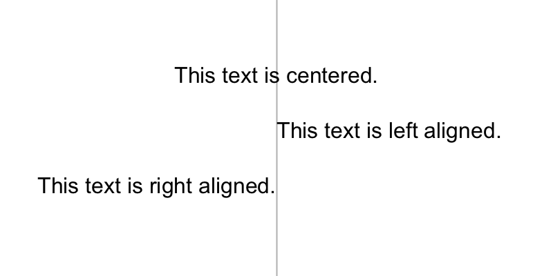
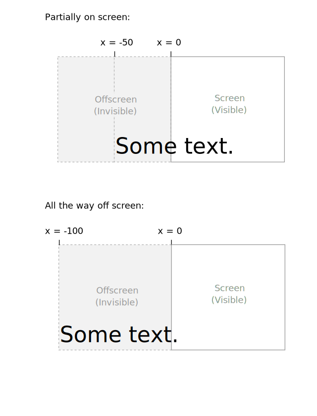
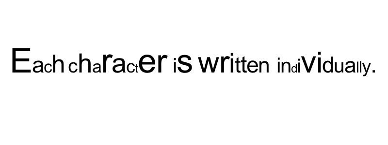
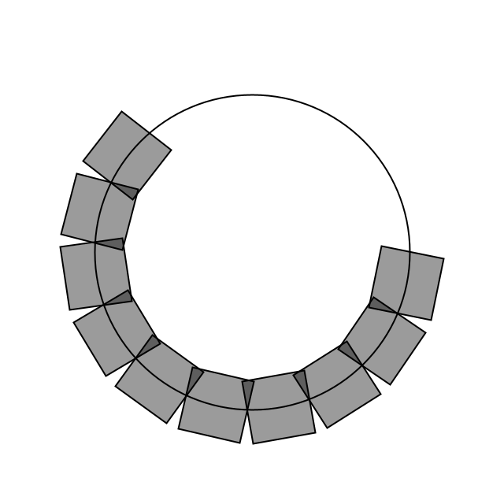
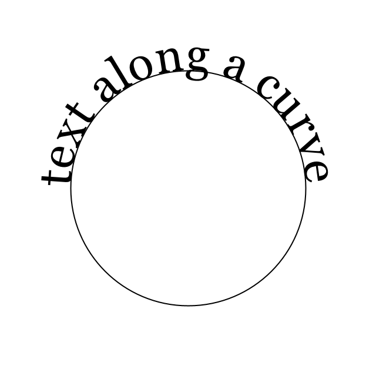

<Note>

This tutorial is from the book [Learning Processing](https://processing.org/books/#shiffman) by Daniel Shiffman, published by Morgan Kaufmann, © 2008 Elsevier Inc. All rights reserved. If you see any errors or have comments, [please let us know](https://github.com/processing/processing-website/issues?q=is%3Aopen).

</Note>

If you are looking to display text onscreen with Processing, you've got to first become familiar with the [String](http://processing.org/reference/String.html) class. Strings are probably not a totally new concept for you, it's quite likely you've dealt with them before. For example, if you've printed some text to the message window or loaded an image from a file, you've written code like so:

```
println("printing some text to the message window!");  // Printing a String
PImage img = loadImage("filename.jpg");                // Using a String for a file name
```

Nevertheless, although you may have used a [String](http://processing.org/reference/String.html) here and there, it's time to unleash their full potential.

## Where do we find documentation for the String class?

Although technically a Java class, because Strings are so commonly used, Processing includes documentation in its reference: [http://www.processing.org/reference/String.html](http://www.processing.org/reference/String.html).

This page only covers some of the available methods of the String class. The full documentation can be found on java's [String](https://docs.oracle.com/javase/8/docs/api/java/lang/String.html) page.

## What is a String?

A String, at its core, is really just a fancy way of storing an array of characters. If we didn't have the String class, we'd probably have to write some code like this:

```
char[] sometext = {'H', 'e', 'l', 'l', 'o', ' ', 'W', 'o', 'r', 'l', 'd'};
```

Clearly, this would be a royal pain in the Processing behind. It's much simpler to do the following and make a String object:

```
String sometext = "How do I make String? Type some characters between quotation marks!";
```

It appears from the above that a String is nothing more than a list of characters in between quotes. Nevertheless, this is only the data of a String. We must remember that a String is an object with methods (which you can find on the reference page.) This is just like how we learned in the [Pixels tutorial](http://processing.org/learning/pixels/) that a [PImage](http://processing.org/reference/PImage.html) stores both the data associated with an image as well as functionality: [copy()](http://processing.org/reference/copy_.html), [loadPixels()](http://processing.org/reference/loadPixels_.html), etc.

For example, the method [charAt()](http://processing.org/reference/String_charAt_.html) returns the individual character in the String at a given index. Note that Strings are just like arrays in that the first character is index #0!

```
String message = "some text here.";
char c = message.charAt(3);
println(c);                // Results in 'e'
```

Another useful method is [length()](http://processing.org/reference/String_length_.html). This is easy to confuse with the length property of an array. However, when we ask for the length of a String object, we must use the parentheses since we are calling a function called `length()` rather than accessing a property called length.

```
String message = "This String is 34 characters long.";
println(message.length());
```

We can also change a String to all uppercase using the [toUpperCase()](http://processing.org/reference/String_toUpperCase_.html) method ([toLowerCase()](http://processing.org/reference/String_toLowerCase_.html) is also available).

```
String uppercase = message.toUpperCase();
println(uppercase);
```

You might notice something a bit odd here. Why didn't we simply say `message.toUpperCase()` and then print `message` variable? Instead, we assigned the result of `message.toUpperCase()` to a new variable with a different name&mdash;`uppercase`.

This is because a String is a special kind of object. It is immutable. An immutable object is one whose data can never be changed. Once we create a String, it stays the same for life. Anytime we want to change the String, we have to create a new one. So in the case of converting to uppercase, the method `toUpperCase()` returns a copy of the String object with all caps.

Finally, let's look at [equals()](http://processing.org/reference/String_equals_.html). Now, Strings can be compared with the `==` operator as follows:

```
String one = "hello";
String two = "hello";
println(one == two);
```

However, technically speaking, when `==` is used with objects, it compares the memory addresses for each object. Even though they contain the same data&mdash;`hello`&mdash; if they are different object instances `==` could result in a false comparison. The [equals()](http://processing.org/reference/String_equals_.html) function ensures that we are checking to see if two String objects contain the exact same sequence of characters, regardless of where that data is stored in the computer's memory.

```
String one = "hello";
String two = "hello";
println(one.equals(two));
```

Although both of the above methods return the correct result, it's safer to use `equals()`. Depending on how String objects are created in a sketch, `==` will not always work.

One other feature of String objects is concatenation, joining two Strings together. Strings are joined with the `+` operator. Plus, of course, usually means add in the case of numbers. When used with Strings, it means join.

```
String helloworld = "Hello" + "World";
```

Variables can also be brought into a String using concatenation.

```
int x = 10;
String message = "The value of x is: " + x;
```

## Displaying Text

The easiest way to display a String is to print it in the message window. This is likely something you've done while debugging. For example, if you needed to know the horizontal mouse location, you would write:

```
println(mouseX);
```

Or if you needed to determine that a certain part of the code was executed, you might print out a descriptive message.

```
println("We got here and we're printing out the mouse location!!!");
```

While this is valuable for debugging, it's not going to help our goal of displaying text for a user. To place text on screen, we have to follow a series of simple steps.

**1. Declare an object of type PFont.**

```
PFont f;
```

**2. Create the font by referencing the font name and the function createFont().**

This should be done only once, usually in [setup()](http://processing.org/reference/setup_.html). Just as with loading an image, the process of loading a font into memory is slow and would seriously affect the sketch's performance if placed inside [draw()](http://processing.org/reference/draw_.html). You can see a list of your available system fonts by via [PFont.list()](http://processing.org/reference/PFont_list_.html). Because of limitations in Java, not all fonts can be used and some might work with one operating system and not others. When sharing a sketch with other people or posting it on the web, you may need to include a .ttf or .otf version of your font in the data directory of the sketch because other people might not have the font installed on their computer. Only fonts that can legally be distributed should be included with a sketch. In addition to the name of the font, you can specify the size as well as whether the font should be antialiased or not.

```
f = createFont("Arial",16,true); // Arial, 16 point, anti-aliasing on
```

**3. Specify the font using textFont()**.

`textFont()` takes one or two arguments, the font variable and the font size, which is optional. If you do not include the font size, the font will be displayed at the size originally loaded. When possible, the `text()` function will use a native font rather than the bitmapped version created behind the scenes with `createFont()` so you have the opportunity to scale the font dynamically. When using P2D, the actual native version of the font will be employed by the sketch, improving drawing lity and performance. With the P3D renderer, the bitmapped version will be used and therefore specifying a font size that is different from the font size loaded can result in pixelated text.

```
textFont(f,36);
```

**4. Specify a color using fill()**.

```
fill(255);
```

**5. Call the text() function to display text.**

This function is just like shape or image drawing, it takes three arguments&mdash;the text to be displayed, and the x and y coordinate to display that text.

```
text("Hello Strings!",10,100);
```

Here are all the steps together:

```
PFont f;                           // STEP 1 Declare PFont variable

void setup() {
  size(200,200);
  f = createFont("Arial",16,true); // STEP 2 Create Font
}

void draw() {
  background(255);
  textFont(f,16);                  // STEP 3 Specify font to be used
  fill(0);                         // STEP 4 Specify font color
  text("Hello Strings!",10,100);   // STEP 5 Display Text
}
```

Fonts can also be created using &ldquo;Tools&rdquo; &rarr; &ldquo;Create Font.&rdquo; This will create and place a VLW font file in your data directory which you can load into a PFont object using [loadFont()](http://processing.org/reference/loadFont_.html).

```
f = loadFont("ArialMT-16.vlw");
```

## Animating Text

Let's look at two more useful Processing functions related to displaying text:

[textAlign()](http://processing.org/reference/textAlign_.html)&mdash;specifies `RIGHT`, `LEFT` or `CENTER` alignment for text.

[Example: Text Align](http://learningprocessing.com/examples/chp17/example-17-02-textalign)

<FixedImage side width={302} height={168}>



</FixedImage>

```
PFont f;

void setup() {
  size(400,200);
  f = createFont("Arial",16,true);
}

void draw() {
  background(255);

  stroke(175);
  line(width/2,0,width/2,height);

  textFont(f);
  fill(0);

  textAlign(CENTER);
  text("This text is centered.",width/2,60);

  textAlign(LEFT);
  text("This text is left aligned.",width/2,100);

  textAlign(RIGHT);
  text("This text is right aligned.",width/2,140);
}
```

[textWidth()](http://processing.org/reference/textWidth_.html)&mdash;Calculates and returns the width of any character or text string.

Let's say we want to create a news ticker, where text scrolls across the bottom of the screen from left to right. When the news headline leaves the window, it reappears on the right hand side and scrolls again. If we know the x location of the beginning of the text and we know the width of that text, we can determine when it is no longer in view. `textWidth()` gives us that width.

To start, we declare headline, font, and x location variables, initializing them in `setup()`.

```
// A headline
String headline = "New study shows computer programming lowers cholesterol.";
PFont f;  // Global font variable
float x;  // horizontal location of headline

void setup() {
  f = createFont("Arial",16,true);  // Loading font
  x = width; // initializing headline off-screen to the right
}
```

In `draw()`, we display the text at the appropriate location.

```
// Display headline at x  location
textFont(f,16);
textAlign(LEFT);
text(headline,x,180);
```

We change x by a speed value (in this case a negative number so that the text moves to the left.)

```
// Decrement x
x = x - 3;
```

Now comes more difficult part. It was easy to test when a circle reached the left side of the screen. We would simply ask: is x less than 0? With text, however, since it is left-aligned, when x equals zero, it is still viewable on screen. Instead, the text will be invisible when x is less than 0 minus the width of the text (See figure below). When that is the case, we reset x back to the right-hand side of the window, i.e. width.

<FixedImage center width={645} height={570}>



</FixedImage>

```
// If x is less than the negative width, then it is completely off the screen
float w = textWidth(headline);
if (x < -w) {
  x = width;
}
```

Here's the full example that displays a different headline each time the previous headline leaves the screen. The headlines are stored in a String array.

[Example: Scrolling Headlines](http://learningprocessing.com/examples/chp17/example-17-03-scrollingtext)

```
// An array of news headlines

String[] headlines = {
  "Processing downloads break downloading record.",
  "New study shows computer programming lowers cholesterol.",
  };

PFont f;  // Global font variable
float x;  // horizontal location of headline
int index = 0;

void setup() {
  size(400,200);
  f = createFont("Arial",16,true);
  // Initialize headline offscreen to the right
  x = width;
}

void draw() {
  background(255);
  fill(0);

  // Display headline at x  location
  textFont(f,16);
  textAlign(LEFT);
  text(headlines[index],x,180);

  // Decrement x
  x = x - 3;

  // If x is less than the negative width,
  // then it is off the screen
  float w = textWidth(headlines[index]);
  if (x < -w) {
    x = width;
    index = (index + 1) % headlines.length;
  }
}
```

In addition to textAlign() and textWidth(), Processing also offers the functions [textLeading()](http://processing.org/reference/textLeading_.html), [textMode()](http://processing.org/reference/textMode_.html), [textSize()](http://processing.org/reference/textSize_.html) for additional display functionality.

## Rotating text

[Translation and rotation](http://processing.org/learning/transform2d/) can also be applied to text. For example, to rotate text around its center, translate to an origin point and use `textAlign(CENTER)` before displaying the text.

[Example: Rotating Text](http://learningprocessing.com/examples/chp17/example-17-05-rotatetext)

```
PFont f;
String message = "this text is spinning";
float theta;

void setup() {
  size(200, 200);
  f = createFont("Arial",20,true);
}

void draw() {
  background(255);
  fill(0);
  textFont(f);                  // Set the font
  translate(width/2,height/2);  // Translate to the center
  rotate(theta);                // Rotate by theta
  textAlign(CENTER);
  text(message,0,0);
  theta += 0.05;                // Increase rotation
}
```

## Displaying text character by character

In certain graphics applications, displaying text with each character rendered individually is required. For example, if each character needs to move or be colored independently then simply saying...

```
text("a bunch of letters",0,0);
```

...will not do.

The solution is to loop through a String, displaying each character one at a time.

Let's start by looking at an example that displays the text all at once.

```
PFont f;
String message = "Each character is not written individually.";

void setup() {
  size(400, 200);
  f = createFont("Arial",20,true);
}

void draw() {
  background(255);
  fill(0);
  textFont(f);
  // Displaying a block of text all at once using text().
  text(message,10,height/2);
}
```

We can rewrite the code to display each character in loop, using the [charAt()](http://processing.org/reference/String_charAt_.html) function.

```
String message = "Each character is written individually.";

// The first character is at pixel 10.
int x = 10;
for (int i = 0; i < message.length(); i++) {
  // Each character is displayed one at a time with the charAt() function.
  text(message.charAt(i),x,height/2);
  // All characters are spaced 10 pixels apart.
  x += 10;
}
```

Calling the [text()](http://processing.org/reference/text_.html) function for each character will allow us more flexibility (for coloring, sizing, and placing characters within one String individually). The above code has a pretty major flaw, however&mdash;the x location is increased by 10 pixels for each character. Although this is approximately correct, because each character is not exactly ten pixels wide, the spacing is off.

The proper spacing can be achieved using the [textWidth()](http://processing.org/reference/textWidth_.html) function as demonstrated in the code below. Note how this example achieves the proper spacing even with each character being a random size!

<FixedImage side width={302} height={131}>



</FixedImage>

```
PFont f;
String message = "Each character is written individually.";

void setup() {
  size(400, 150);
  f = createFont("Arial",20,true);
}

void draw() {
  background(255);
  fill(0);
  textFont(f);
  int x = 10;
  for (int i = 0; i < message.length(); i++) {
    textSize(random(12,36));
    text(message.charAt(i),x,height/2);
    // textWidth() spaces the characters out properly.
    x += textWidth(message.charAt(i));
  }
  noLoop();
}
```

This &ldquo;letter by letter&rdquo; methodology can also be applied to a sketch where characters from a String move independently of one another. The following example uses object-oriented design to make each character from the original String a Letter object, allowing it to both be a displayed in its proper location as well as move about the screen individually.

[Example: Text breaking up](http://learningprocessing.com/examples/chp17/example-17-06-textbreakingup)

```
PFont f;
String message = "click mouse to shake it up";
// An array of Letter objects
Letter[] letters;

void setup() {
  size(260, 200);
  // Load the font
  f = createFont("Arial",20,true);
  textFont(f);

  // Create the array the same size as the String
  letters = new Letter[message.length()];
  // Initialize Letters at the correct x location
  int x = 16;
  for (int i = 0; i < message.length(); i++) {
    letters[i] = new Letter(x,100,message.charAt(i));
    x += textWidth(message.charAt(i));
  }
}

void draw() {
  background(255);
  for (int i = 0; i < letters.length; i++) {
    // Display all letters
    letters[i].display();

    // If the mouse is pressed the letters shake
    // If not, they return to their original location
    if (mousePressed) {
      letters[i].shake();
    } else {
      letters[i].home();
    }
  }
}

// A class to describe a single Letter
class Letter {
  char letter;
  // The object knows its original "home" location
  float homex,homey;
  // As well as its current location
  float x,y;

  Letter (float x_, float y_, char letter_) {
    homex = x = x_;
    homey = y = y_;
    letter = letter_;
  }

  // Display the letter
  void display() {
    fill(0);
    textAlign(LEFT);
    text(letter,x,y);
  }

  // Move the letter randomly
  void shake() {
    x += random(-2,2);
    y += random(-2,2);
  }

  // Return the letter home
  void home() {
    x = homex;
    y = homey;
  }
}
```

The character by character method also allows us to display text along a curve. Before we move on to letters, let's first look at how we would draw a series of boxes along a curve. This example makes heavy use of [Trignometry](http://www.processing.org/learning/trig/).

[Example: Boxes along a curve](http://learningprocessing.com/examples/chp17/example-17-07-boxesoncurve)

<FixedImage side width={200} height={200}>



</FixedImage>

```
PFont f;
// The radius of a circle
float r = 100;
// The width and height of the boxes
float w = 40;
float h = 40;

void setup() {
  size(320, 320);
  smooth();
}

void draw() {
  background(255);

  // Start in the center and draw the circle
  translate(width / 2, height / 2);
  noFill();
  stroke(0);
  // Our curve is a circle with radius r in the center of the window.
  ellipse(0, 0, r*2, r*2);

  // 10 boxes along the curve
  int totalBoxes = 10;
  // We must keep track of our position along the curve
  float arclength = 0;

  // For every box
  for (int i = 0; i < totalBoxes; i++) {
    // Each box is centered so we move half the width
    arclength += w/2;
    // Angle in radians is the arclength divided by the radius
    float theta = arclength / r;

    pushMatrix();
    // Polar to cartesian coordinate conversion
    translate(r*cos(theta), r*sin(theta));
    // Rotate the box
    rotate(theta);
    // Display the box
    fill(0,100);
    rectMode(CENTER);
    rect(0,0,w,h);
    popMatrix();
    // Move halfway again
    arclength += w/2;
  }
}
```

What we need to do is replace each box with a character from a String that fits inside the box. And since characters all do not have the same width, instead of using a variable `w` that stays constant, each box will have a variable width along the curve according to the `textWidth()` function.

[Example: Characters along a curve](http://www.learningprocessing.com/examples/chapter-17/example-17-8/)

<FixedImage side width={200} height={200}>



</FixedImage>

```
// The message to be displayed
String message = "text along a curve";

PFont f;
// The radius of a circle
float r = 100;

void setup() {
  size(320, 320);
  f = createFont("Georgia",40,true);
  textFont(f);
  // The text must be centered!
  textAlign(CENTER);
  smooth();
}

void draw() {
  background(255);

  // Start in the center and draw the circle
  translate(width / 2, height / 2);
  noFill();
  stroke(0);
  ellipse(0, 0, r*2, r*2);

  // We must keep track of our position along the curve
  float arclength = 0;

  // For every box
  for (int i = 0; i < message.length(); i++)
  {
    // Instead of a constant width, we check the width of each character.
    char currentChar = message.charAt(i);
    float w = textWidth(currentChar);

    // Each box is centered so we move half the width
    arclength += w/2;
    // Angle in radians is the arclength divided by the radius
    // Starting on the left side of the circle by adding PI
    float theta = PI + arclength / r;

    pushMatrix();
    // Polar to cartesian coordinate conversion
    translate(r*cos(theta), r*sin(theta));
    // Rotate the box
    rotate(theta+PI/2); // rotation is offset by 90 degrees
    // Display the character
    fill(0);
    text(currentChar,0,0);
    popMatrix();
    // Move halfway again
    arclength += w/2;
  }
}
```

_Special thanks to [Ariel Malka](http://ariel.chronotext.org/) for his advice on this last curved text example._
